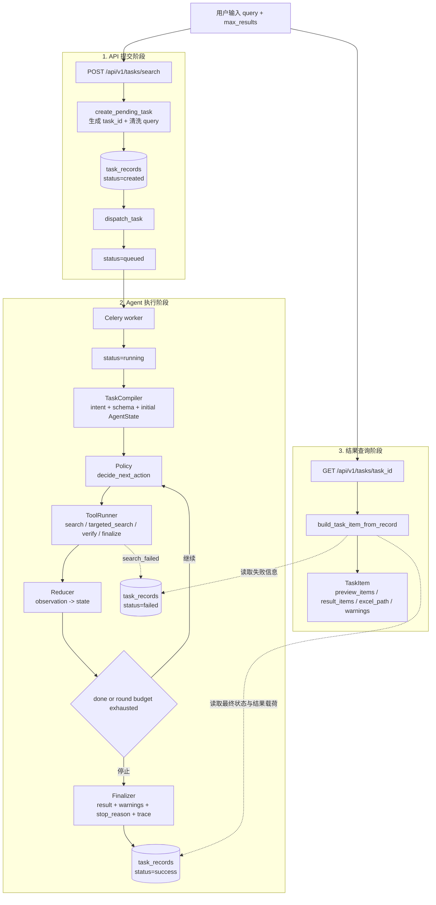

# rebuild_agent

一个通用的 `Natural Language Query -> Structured Data Output` 轻量 Agent。用户提交开放领域自然语言查询后，API 负责创建任务并入队，Celery worker 通过显式 Agent Loop 完成任务编译、状态决策、工具执行、状态归约和最终输出，最终通过任务接口查询结构化结果。

## 当前状态

- 任务受理链路已经切到 `create -> queued -> worker -> running -> success/failed`
- 执行链路已收敛为 `TaskCompiler -> Agent Loop -> Finalizer`
- `AgentState` 统一承载 query、task_type、schema、slots、evidence、trace、warnings 和 stop_reason
- `Policy` 集中承担决策，只输出 `search / targeted_search / verify / finalize` 这 4 类动作
- `ToolRunner` 只负责执行动作：联网搜索、结构化抽取、fallback、Excel 导出
- `Reducer` 把 observation 写回 state，并更新 slots、evidence、warnings 和 done 标记
- 结构化失败或返回空结果时，会回退到候选结果生成 fallback 输出
- 最终任务对象会返回 `used_fallback / result_quality / warnings`，Agent 输出内部保留 trace / slots / stop_reason
- `pytest` 当前通过：`47 passed`

## System Design Philosophy

本项目定位为面向开放查询场景的状态驱动结构化 Agent：通过一次性任务编译初始化状态，再围绕 `State -> Decide -> Act -> Update` 循环持续补齐结果槽位，把自然语言问题稳定转化为可查询、可导出、可复用的结构化数据。

```text
Natural Language Query
-> TaskCompiler
-> AgentState
-> Policy.decide_next_action
-> ToolRunner.run_action
-> Reducer.reduce_state
-> Finalizer.build_output
-> Structured Data Output
```

设计原则：

- 开放场景适配：以自然语言查询为入口，将不同主题的检索需求统一收敛到稳定的结构化数据生成链路。
- State-first：执行期上下文统一进入 `AgentState`，不再拆散成多套控制对象。
- Policy-first：决策集中在 `Policy`，其余组件只做编译、执行、归约或最终组织。
- Schema 驱动输出：通过 schema registry 管理输出结构，让结果字段、校验规则和后续扩展保持清晰边界。
- Workflow-first：以可观测、可恢复的任务工作流承载 Agent 能力，保证提交、执行、查询、重试和导出链路稳定可控。
- 可解释执行：用 trace、slots、evidence 和 stop_reason 展示每轮 Agent 决策与结果。
- 质量内建：quality 不只是报告字段，也会作为 state / policy 可消费的控制信号。

## 技术栈

- Web：FastAPI + Uvicorn
- 任务调度：Celery + Redis
- 数据库：PostgreSQL + SQLAlchemy Async + Alembic + asyncpg
- 搜索：DuckDuckGo HTML / Sogou HTML + `httpx` + `lxml`
- 结构化抽取：LangChain + OpenAI Compatible Chat API + Pydantic
- 导出：Pandas + OpenPyXL
- 日志：Loguru
- 测试：Pytest + Pytest-Asyncio

## 核心流程

可以把这条链路分成 4 段来看：

- 提交任务：用户发起自然语言问题，API 创建任务并投递到 Celery
- 任务编译：worker 使用 `TaskCompiler` 解析 intent、选择 schema，并初始化 `AgentState`
- 执行任务：worker 运行 `decide -> act -> reduce` 循环，完成搜索、结构化整理、fallback、质量标注与 Excel 导出
- 查询结果：前端或调用方通过任务详情接口轮询最终结构化结果、预览结果和导出文件路径

```text
用户输入 query
-> POST /api/v1/tasks/search
-> 创建 task_record(status=created)
-> dispatch_task 投递到 Celery / Redis
-> 更新 status=queued
-> 返回 202 + task_id

Celery worker 消费任务
-> status=running
-> TaskCompiler.compile_task 初始化 AgentState
-> Policy 决定 action：search / targeted_search / verify / finalize
-> ToolRunner 执行 action：搜索、结构化抽取、fallback、导出
-> Reducer 写回 observation：更新 slots / evidence / warnings / done
-> 循环直到 required slots filled、搜索失败或 round budget 用尽
-> Finalizer 输出 result / warnings / stop_reason / trace
-> 写回 task_records(status/result_payload/excel_path/error_message)

客户端轮询 GET /api/v1/tasks/{task_id}
-> task_presenter 把记录转换为 TaskItem
-> 返回 preview_items / result_items / excel_path / status / error / result_quality / warnings
```



## Agent 运行方式

正常业务代码运行 Agent 时，不需要手动传入搜索、抽取、导出这些函数。`run_agent()` 已经给这些能力配置了默认函数：

```python
agent_output = await run_agent(
    query="AI 产品经理",
    task_id="task-001",
    max_results=5,
)
```

上面这种写法会自动使用项目里的默认能力：

- `parse_search_intent`：解析 query 属于 general / lookup / collection / comparison 哪种任务
- `resolve_output_schema`：选择本次任务使用的输出 schema
- `search_web`：执行联网搜索
- `build_candidates`：把搜索结果转换成候选结果
- `select_top_candidates`：做去重和 top-k 选择
- `build_rebuild_prompt_input`：整理结构化抽取输入
- `build_structured_results`：调用 LLM 生成结构化结果
- `build_fallback_structured_items`：结构化失败时生成 fallback 结果
- `evaluate_result_quality`：给结果打轻量质量标记
- `export_results_to_excel`：导出 Excel

这些函数也可以作为参数传进去，目的是方便测试或替换某个能力。例如测试时不想真的联网、不想真的调用 LLM、不想真的导出 Excel，可以这样传 fake 函数：

```python
agent_output = await run_agent(
    query="AI 产品经理",
    task_id="task-test",
    max_results=5,
    search_func=fake_search_web,
    build_structured_results_func=fake_build_structured_results,
    export_results_to_excel_func=lambda items: None,
)
```

所以这里的设计可以理解为：

```text
正常运行：只传 query / task_id / max_results
测试或扩展：额外传入要替换的能力函数
```

## 主要模块

- `main.py`：应用入口、生命周期、全局异常处理
- `routers/task_router.py`：创建任务、查询任务详情
- `conf/celery_app.py`：Celery 应用初始化
- `tasks.py`：Celery task 注册入口
- `agent/state.py`：`AgentState`、`Evidence`、`ActionTrace`，统一承载执行期上下文
- `agent/compiler.py`：任务编译入口，折叠原 intent parser + schema resolver 的运行时入口
- `agent/policy.py`：集中决策下一步 action
- `agent/reducer.py`：把 observation 写回 state，更新 slots / evidence / warnings / done
- `agent/runner.py`：显式 Agent Loop：`compile -> decide -> act -> reduce -> finalize`
- `agent/finalizer.py`：组织最终输出、trace、warnings 和 stop_reason
- `tools/tool_runner.py`：执行 `search / targeted_search / verify / finalize` 动作
- `utils/task_dispatcher.py`：任务入队与 dispatch 元数据封装
- `utils/task_runner.py`：worker 侧执行入口
- `utils/task_service.py`：任务状态落库、Agent 运行结果适配和 API 返回对象组装
- `utils/task_service_helpers.py`：文本清洗、top-k、候选映射、fallback、结果拼装、质量标注
- `utils/intent_parser.py`：把自然语言 query 解析为通用查询形态
- `schemas/registry.py`：解析当前任务使用的输出 schema
- `utils/search_client.py`：联网搜索 provider
- `utils/retriever.py`：二阶段结构化输入重建
- `utils/structured_result_builder.py`：LLM 结构化抽取
- `utils/task_presenter.py`：数据库记录转接口模型
- `schemas/search_schema.py`：搜索请求、搜索结果、候选结果、结构化结果
- `schemas/intent_schema.py`：查询意图模型
- `schemas/agent_schema.py`：输出 schema、`AgentAction`、`ToolObservation`、`AgentRuntimeResult`、`AgentOutput` 等 Agent 运行期返回模型
- `schemas/task_schema.py`：任务状态和任务接口返回模型
- `schemas/task_dispatch_schema.py`：dispatcher 边界模型

## API

### 创建任务

`POST /api/v1/tasks/search`

请求体位置：`schemas/search_schema.py`

```json
{
  "query": "大模型应用架构设计",
  "max_results": 5
}
```

成功响应现在返回 `queued`，而不是旧的 `pending`：

```json
{
  "success": true,
  "message": "success",
  "data": {
    "task_id": "a1b2c3d4",
    "query": "大模型应用架构设计",
    "status": "queued",
    "total_items": 0,
    "excel_path": null,
    "preview_items": [],
    "result_items": [],
    "message": "任务已排队",
    "error": null,
    "attempt_count": 0,
    "used_fallback": false,
    "result_quality": "unknown",
    "warnings": []
  }
}
```

### 查询任务

`GET /api/v1/tasks/{task_id}`

成功后可拿到：

- `status`
- `preview_items`
- `result_items`
- `excel_path`
- `error`
- `used_fallback`
- `result_quality`
- `warnings`

`result_quality` 是轻量质量标注，不等同于事实核查：

- `high`：结构化结果存在，且质量分、URL 等基础字段正常
- `fallback`：结构化阶段失败或为空，结果来自候选搜索结果保底生成
- `low`：结果为空、平均质量分过低或存在明显结构问题
- `unknown`：任务尚未完成或历史记录未写入质量信息

### 任务列表

`GET /api/v1/tasks`

支持查询参数：

- `status`：按任务状态过滤
- `query`：按任务 query / task_id 模糊过滤
- `limit`：分页大小，默认 `20`
- `offset`：分页偏移，默认 `0`

返回结构示例：

```json
{
  "success": true,
  "message": "success",
  "data": {
    "items": [
      {
        "task_id": "a1b2c3d4",
        "query": "AI 产品经理",
        "status": "success",
        "total_items": 5,
        "excel_path": "E:/python_files/rebuild_agent/outputs/structured_search_result_<query>_<timestamp>.xlsx",
        "preview_items": [],
        "result_items": [],
        "message": "任务执行完成",
        "error": null,
        "attempt_count": 0,
        "used_fallback": false,
        "result_quality": "unknown",
        "warnings": []
      }
    ],
    "count": 1,
    "limit": 20,
    "offset": 0
  }
}
```

### 重试任务

`POST /api/v1/tasks/{task_id}/retry?max_results=5`

当前仅允许这些状态重试：

- `failed`
- `timeout`
- `partial_success`

说明：

- 重试会清空旧的 `result_payload / excel_path / error_message`，并将任务重新派发到队列
- 由于当前数据库尚未持久化原始 `max_results`，重试接口要求显式传入或接受默认值

## 目录结构

```text
rebuild_agent/
├─ main.py
├─ tasks.py
├─ conf/
├─ crud/
├─ models/
├─ routers/
├─ schemas/
├─ utils/
├─ tests/
├─ scripts/
├─ alembic/
├─ outputs/
├─ storage/
├─ docker-compose.yml
└─ pyproject.toml
```

## 环境变量

复制环境变量文件：

```bash
# macOS / Linux
cp .env.example .env

# Windows PowerShell
Copy-Item .env.example .env
```

关键配置：

- `DATABASE_URL`：PostgreSQL 连接串
- `CELERY_BROKER_URL`：Celery broker，默认 Redis `0` 号库
- `CELERY_RESULT_BACKEND`：Celery backend，默认 Redis `1` 号库
- `CELERY_TASK_EXPIRES_SECONDS`：Celery 消息允许被 worker 执行的最长等待时间，默认 `300` 秒；超过后 worker 会跳过并把任务标记为 `timeout`
- `DASHSCOPE_API_KEY`：结构化抽取使用的模型 API Key
- `LLM_BASE_URL` / `LLM_MODEL_NAME`：OpenAI Compatible 模型配置
- `STRUCTURED_STAGE_TIMEOUT_SECONDS`：结构化阶段超时
- `SEARCH_PROVIDER`：默认 `auto`，按 `duckduckgo_html -> bing_html -> sogou_html` 顺序尝试普通搜索引擎；也可指定其中一个 provider 单独运行
- `SEARCH_PROXY_URL`：搜索请求使用的显式代理，例如 `http://127.0.0.1:7890`；Celery worker 读不到系统代理时建议配置
- `SEARCH_TRUST_ENV`：是否读取 `HTTP_PROXY / HTTPS_PROXY` 等环境代理，默认 `true`
- `SEARCH_FAILURE_LLM_FALLBACK_ENABLED`：联网搜索失败时是否继续使用 LLM 本地知识兜底，默认 `true`；结果会带 warning，表示不是联网搜索结果

`.env.example` 中已经包含上述默认项。

## 本地启动

### 1. 安装依赖

```bash
uv sync
uv sync --group dev
```

### 2. 初始化数据库

```bash
uv run alembic upgrade head
```

### 3. 启动 Redis

本地需要一个可用的 Redis 实例，默认地址：

```text
redis://127.0.0.1:6379/0
redis://127.0.0.1:6379/1
```

### 4. 启动 Celery worker

Windows 本地开发请使用 `solo` pool，避免 `billiard` 进程池权限错误：

```powershell
uv run celery -A conf.celery_app:celery_app worker --pool=solo --loglevel=INFO -Q search_queue
```

macOS / Linux 可继续使用默认 pool：

```bash
uv run celery -A conf.celery_app:celery_app worker --loglevel=INFO -Q search_queue
```

### 5. 启动 API

```bash
uv run uvicorn main:app --reload --host 127.0.0.1 --port 8000
```

## Docker Compose

当前 `docker-compose.yml` 已包含：

- `app`
- `worker`
- `db`
- `redis`

启动：

```bash
docker compose up --build
```

## 压测

项目提供两个压测脚本：

- `scripts/benchmark_api.py`：固定请求总量的基准测试，适合快速比较单次改动前后的接口延迟。
- `scripts/load_test_api.py`：持续时长型压测，适合观察固定并发下的吞吐、延迟分位数和错误率。

压测口径需要区分两类：

- `create`：只测试 `POST /api/v1/tasks/search` 的受理和入队速度，不代表 Agent 已经执行完成。
- `agent`：测试 `create + 轮询 GET /api/v1/tasks/{task_id} 直到终态`，更接近真实 Agent 任务端到端耗时。

先启动 API，再运行压测脚本：

```bash
uv run python scripts/load_test_api.py --scenario health --duration-seconds 30 --concurrency 20
```

如果只压任务受理和入队，需要确保 PostgreSQL、Redis 可用：

```bash
uv run python scripts/load_test_api.py --scenario create --duration-seconds 10 --concurrency 2 --think-time-ms 100 --max-results 1
```

如果要压完整 Agent 端到端链路，需要确保 PostgreSQL、Redis、Celery worker、搜索源和 LLM 配置都可用：

```bash
uv run python scripts/load_test_api.py --scenario agent --duration-seconds 60 --concurrency 2 --think-time-ms 100 --max-results 1 --poll-timeout-seconds 120
```

输出 JSON 方便后续归档或画图：

```bash
uv run python scripts/load_test_api.py --scenario agent --duration-seconds 60 --concurrency 2 --think-time-ms 100 --max-results 1 --output json
```

固定请求总量的快速基准测试也支持 Agent 完成探针：

```bash
uv run python scripts/benchmark_api.py --include-agent-completion --agent-completion-total 3 --agent-completion-concurrency 1 --max-results 1
```

### 历史本机压测结果

下面这组数据是 Agent Loop 重构前的历史基线，用于对比 API 层受理、列表、详情接口的大致量级。由于当前执行链路已经改成 `TaskCompiler -> Policy -> ToolRunner -> Reducer -> Finalizer`，完整 Agent 端到端结果需要使用新的 `agent` 场景重新采集。

测试环境：Windows 本机开发环境，API 使用 `uv run uvicorn main:app --host 127.0.0.1 --port 8000` 单进程启动，压测客户端与服务端在同一台机器上。测试时间：2026-04-15。

| 接口场景 | 压测参数 | 请求数 | 成功率 | 吞吐量 RPS | 平均响应 | P50 | P95 | P99 | 状态码 |
| --- | --- | ---: | ---: | ---: | ---: | ---: | ---: | ---: | --- |
| `GET /health` | `30s / concurrency=20` | 32553 | 100.00% | 1091.38 | 18.31ms | 8.42ms | 61.29ms | 101.72ms | `200: 32553` |
| `GET /api/v1/tasks` | `30s / concurrency=10` | 8663 | 100.00% | 290.25 | 34.43ms | 33.30ms | 38.20ms | 51.39ms | `200: 8663` |
| `GET /api/v1/tasks/{task_id}` | `30s / concurrency=10` | 15436 | 100.00% | 518.20 | 19.29ms | 18.41ms | 22.49ms | 34.45ms | `200: 15436` |
| `POST /api/v1/tasks/search` | `10s / concurrency=2 / think-time=100ms` | 115 | 100.00% | 11.67 | 64.21ms | 52.76ms | 164.57ms | 209.66ms | `202: 115` |
| `AGENT create+poll terminal` | 重构后待复测 | - | - | - | - | - | - | - | - |

对应命令：

```bash
uv run python scripts/load_test_api.py --scenario health --duration-seconds 30 --concurrency 20 --output json
uv run python scripts/load_test_api.py --scenario list --duration-seconds 30 --concurrency 10 --output json
uv run python scripts/load_test_api.py --scenario detail --duration-seconds 30 --concurrency 10 --output json
uv run python scripts/load_test_api.py --scenario create --duration-seconds 10 --concurrency 2 --think-time-ms 100 --max-results 1 --output json
uv run python scripts/load_test_api.py --scenario agent --duration-seconds 60 --concurrency 2 --think-time-ms 100 --max-results 1 --poll-timeout-seconds 120 --output json
```

解读：

- `/health` 主要反映 FastAPI/Uvicorn 的基础 HTTP 开销，不代表完整业务链路能力。
- 任务列表和详情接口都经过数据库查询，当前本机读接口 P95 分别约为 `38.20ms` 和 `22.49ms`。
- `POST /api/v1/tasks/search` 会真实写库并投递 Celery/Redis，但它只代表受理能力，不代表 Agent 执行完成。
- `AGENT create+poll terminal` 才代表完整 Agent 端到端耗时，受搜索源、LLM、worker 并发、队列积压和 Excel 导出影响更大。
- 这些数据是本机开发环境结果，生产环境需要在目标机器、目标 worker 数、目标数据库和 Redis 配置下重新压测。

可选场景：

- `health`：只压 `GET /health`，用于观察 API 基础吞吐和框架开销。
- `create`：只压 `POST /api/v1/tasks/search`，会真实创建任务并入队，但不等待 Agent 完成。
- `list`：只压 `GET /api/v1/tasks`，用于观察任务列表查询性能。
- `detail`：先创建一个种子任务，再压 `GET /api/v1/tasks/{task_id}`。
- `agent`：创建任务后持续轮询详情接口直到任务进入 `success / failed / timeout` 等终态，用于观察 Agent 端到端耗时。
- `mixed`：按比例混合 `health / list / create / detail`，更接近综合访问形态；默认不包含完整 `agent` 端到端任务，避免无意中大量触发搜索和 LLM。
- 在 `agent` 场景中，`--duration-seconds` 表示持续发起任务的时间窗口；已经发起的任务会继续等待到终态或 `--poll-timeout-seconds`，所以脚本实际运行时间可能超过 `duration-seconds`。

压测指标说明：

- `total`：压测期间实际发出的请求总数。
- `concurrency`：并发请求 worker 数，不等同于 QPS。
- `rps`：每秒完成请求数，计算方式为 `total / duration_seconds`。
- `success`：HTTP 状态码在 `2xx` 范围内的请求数。
- `errors`：非 `2xx` 响应和请求异常数量。
- `success_rate` / `error_rate`：成功率与错误率，单位是百分比。
- `avg_ms`：平均响应耗时，容易受慢请求影响。
- `p50_ms`：中位响应耗时，代表典型请求体验。
- `p90_ms` / `p95_ms` / `p99_ms`：尾部延迟，优先关注 `p95_ms` 和 `p99_ms` 是否异常放大。
- `min_ms` / `max_ms`：最小和最大响应耗时，用于快速发现极端值。
- `status_codes`：状态码分布，用于区分参数错误、服务错误、限流或上游异常；在 `agent` 场景中，任务终态失败会被计入错误。
- `sample_errors`：最多保留 5 条错误样本，便于快速定位失败原因。

注意：`create`、`agent` 和 `mixed` 场景会真实调用任务创建接口，可能触发 worker 搜索、LLM 调用和 Excel 导出。压测前建议把 `--max-results` 设小，并确认测试环境的模型额度、Redis 队列和数据库写入能力足够。

## 测试

运行测试：

```bash
uv run pytest
```

当前覆盖：

- 根路由与健康检查
- 创建任务与查询任务接口
- 请求参数校验与全局异常处理
- 搜索结果解析
- 任务编排成功/失败/降级路径
- TaskCompiler / Policy / Agent Loop / result quality 轻量组件
- Excel 导出

当前结果：

```text
47 passed
```

## Engineering Highlights

- 多阶段任务链路：API 受理、Celery 派发、Worker 执行、状态查询和结果导出边界清晰，便于扩展和排障。
- 可解释 Agent 流程：`AgentState`、`Policy`、`Reducer`、trace、slots 和 stop_reason 共同记录每轮决策与状态变化。
- 结构化优先：搜索结果会经过清洗、候选构造、top-k 重排、LLM 抽取和 fallback 兜底，保证接口返回稳定结构。
- 质量信号内置：`used_fallback / result_quality / warnings` 直接进入任务结果，方便前端展示和调用方判断可靠性。
- 性能可观测：提供固定总量 benchmark 和持续时长 load test 两类脚本，可直接观察 RPS、平均响应时间、P95/P99 和错误率。
- 本地与容器双路径：支持本地 `uv` 启动，也提供 Docker Compose 编排 API、worker、db 和 redis。
