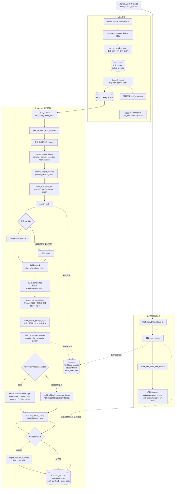

# rebuild_agent

一个通用的 `Natural Language Query -> Structured Data Output` 系统。用户提交开放领域自然语言查询后，API 负责创建任务并入队，Celery worker 负责完成意图解析、Schema 解析、搜索、结构化整理、质量标注和 Excel 导出，最终通过任务接口查询状态与结构化结果。

## 当前状态

- 任务受理链路已经切到 `create -> queued -> worker -> running -> success/failed`
- 查询进入执行链路前会先解析为通用查询形态 intent：`general / lookup / collection / comparison`
- 当前默认使用 `generic_search_result` 输出 schema，后续可以扩展为更多查询形态 schema
- 执行侧已加入轻量 planner，用于显式表达 `search -> rank -> structure -> export` 的计划
- 搜索结果经过统一清洗、top-k 选择、候选映射后再进入结构化阶段
- 结构化阶段已恢复真实 `prompt + llm + parser` 实现
- 结构化失败或返回空结果时，会回退到候选结果生成 fallback 输出
- 最终任务对象会返回 `used_fallback / result_quality / warnings` 这类轻量质量标注
- `pytest` 当前通过：`34 passed`

## System Design Philosophy

本项目不是某个垂直场景 Agent，而是一个通用结构化数据生成 pipeline：

```text
Natural Language Query
-> Intent Parser
-> Schema Resolver
-> Planner
-> Search / Rank / Structure / Export
-> Task Memory
-> Result Quality Check
-> Structured Data Output
```

设计原则：

- 领域无关：具体业务查询只是使用场景，不是系统边界。
- Schema 可扩展：当前只有默认 `generic_search_result`，但 schema 解析层已经独立。
- Workflow-first：保留稳定工程链路，不引入复杂多轮 Agent runtime。
- 轻量 Agent-like：用 Intent、Schema、Planner、Task Memory 表达可解释执行过程。
- 不做独立自我评估模块：只做 `result_quality` 标注，不触发自动重试或自我修复循环。

## 技术栈

- Web：FastAPI + Uvicorn
- 任务调度：Celery + Redis
- 数据库：PostgreSQL + SQLAlchemy Async + Alembic + asyncpg
- 搜索：DuckDuckGo HTML / Sogou HTML + `httpx` + `lxml`
- 结构化抽取：LangChain + OpenAI Compatible Chat API + Pydantic
- 导出：Pandas + OpenPyXL
- 日志：Loguru
- 测试：Pytest + Pytest-Asyncio

## 核心流程

可以把这条链路分成 4 段来看：

- 提交任务：用户发起自然语言问题，API 创建任务并投递到 Celery
- 任务理解：worker 解析 intent、解析输出 schema，并构造轻量执行计划
- 执行任务：worker 完成联网搜索、结果清洗、候选构造、LLM 结构化整理、fallback、质量标注与 Excel 导出
- 查询结果：前端或调用方通过任务详情接口轮询最终结构化结果、预览结果和导出文件路径

```text
用户输入 query
-> POST /api/v1/tasks/search
-> 创建 task_record(status=created)
-> dispatch_task 投递到 Celery / Redis
-> 更新 status=queued
-> 返回 202 + task_id

Celery worker 消费任务
-> status=running
-> parse_search_intent 解析查询形态
-> resolve_output_schema 解析输出 schema
-> build_execution_plan 构造 search/rank/structure/export 计划
-> search_web 联网搜索
-> build_candidates 映射为候选结果
-> select_top_candidates 去重 + 简单相关性重排 + top-k
-> build_rebuild_prompt_input 重建结构化提示词输入
-> build_structured_results 调用 prompt + llm + parser
-> 若结构化失败或为空则 fallback 到候选结果
-> evaluate_result_quality 标注 high/fallback/low
-> export_results_to_excel 导出 Excel
-> 写回 task_records(status/result_payload/excel_path/error_message)

客户端轮询 GET /api/v1/tasks/{task_id}
-> task_presenter 把记录转换为 TaskItem
-> 返回 preview_items / result_items / excel_path / status / error / result_quality / warnings
```



## 主要模块

- `main.py`：应用入口、生命周期、全局异常处理
- `routers/task_router.py`：创建任务、查询任务详情
- `conf/celery_app.py`：Celery 应用初始化
- `tasks.py`：Celery task 注册入口
- `utils/task_dispatcher.py`：任务入队与 dispatch 元数据封装
- `utils/task_runner.py`：worker 侧执行入口
- `utils/task_service.py`：intent、schema、plan、搜索、结构化、导出和状态更新主编排
- `utils/task_service_helpers.py`：文本清洗、top-k、候选映射、fallback、结果拼装、质量标注
- `utils/intent_parser.py`：把自然语言 query 解析为通用查询形态
- `utils/schema_registry.py`：解析当前任务使用的输出 schema
- `utils/planner.py`：生成轻量执行计划，保留工具语义但不引入动态 tool registry
- `utils/search_client.py`：联网搜索 provider
- `utils/retriever.py`：二阶段结构化输入重建
- `utils/structured_result_builder.py`：LLM 结构化抽取
- `utils/task_presenter.py`：数据库记录转接口模型
- `schemas/search_schema.py`：搜索请求、搜索结果、候选结果、结构化结果
- `schemas/intent_schema.py`：查询意图模型
- `schemas/agent_schema.py`：执行计划、输出 schema、任务记忆等轻量边界模型
- `schemas/task_schema.py`：任务状态和任务接口返回模型
- `schemas/task_dispatch_schema.py`：dispatcher 边界模型

## API

### 创建任务

`POST /api/v1/tasks/search`

请求体位置：`schemas/search_schema.py`

```json
{
  "query": "大模型应用架构设计",
  "max_results": 5
}
```

成功响应现在返回 `queued`，而不是旧的 `pending`：

```json
{
  "success": true,
  "message": "success",
  "data": {
    "task_id": "a1b2c3d4",
    "query": "大模型应用架构设计",
    "status": "queued",
    "total_items": 0,
    "excel_path": null,
    "preview_items": [],
    "result_items": [],
    "message": "任务已排队",
    "error": null,
    "attempt_count": 0,
    "used_fallback": false,
    "result_quality": "unknown",
    "warnings": []
  }
}
```

### 查询任务

`GET /api/v1/tasks/{task_id}`

成功后可拿到：

- `status`
- `preview_items`
- `result_items`
- `excel_path`
- `error`
- `used_fallback`
- `result_quality`
- `warnings`

`result_quality` 是轻量质量标注，不等同于事实核查：

- `high`：结构化结果存在，且质量分、URL 等基础字段正常
- `fallback`：结构化阶段失败或为空，结果来自候选搜索结果保底生成
- `low`：结果为空、平均质量分过低或存在明显结构问题
- `unknown`：任务尚未完成或历史记录未写入质量信息

### 任务列表

`GET /api/v1/tasks`

支持查询参数：

- `status`：按任务状态过滤
- `query`：按任务 query / task_id 模糊过滤
- `limit`：分页大小，默认 `20`
- `offset`：分页偏移，默认 `0`

返回结构示例：

```json
{
  "success": true,
  "message": "success",
  "data": {
    "items": [
      {
        "task_id": "a1b2c3d4",
        "query": "AI 产品经理",
        "status": "success",
        "total_items": 5,
        "excel_path": "E:/python_files/rebuild_agent/outputs/structured_search_result_AI_产品经理_20260415_094851.xlsx",
        "preview_items": [],
        "result_items": [],
        "message": "任务执行完成",
        "error": null,
        "attempt_count": 0,
        "used_fallback": false,
        "result_quality": "unknown",
        "warnings": []
      }
    ],
    "count": 1,
    "limit": 20,
    "offset": 0
  }
}
```

### 重试任务

`POST /api/v1/tasks/{task_id}/retry?max_results=5`

当前仅允许这些状态重试：

- `failed`
- `timeout`
- `partial_success`

说明：

- 重试会清空旧的 `result_payload / excel_path / error_message`，并将任务重新派发到队列
- 由于当前数据库尚未持久化原始 `max_results`，重试接口要求显式传入或接受默认值

## 目录结构

```text
rebuild_agent/
├─ main.py
├─ tasks.py
├─ conf/
├─ crud/
├─ models/
├─ routers/
├─ schemas/
├─ utils/
├─ tests/
├─ docs/
├─ scripts/
├─ alembic/
├─ outputs/
├─ storage/
├─ docker-compose.yml
└─ pyproject.toml
```

## 环境变量

复制环境变量文件：

```bash
# macOS / Linux
cp .env.example .env

# Windows PowerShell
Copy-Item .env.example .env
```

关键配置：

- `DATABASE_URL`：PostgreSQL 连接串
- `CELERY_BROKER_URL`：Celery broker，默认 Redis `0` 号库
- `CELERY_RESULT_BACKEND`：Celery backend，默认 Redis `1` 号库
- `DASHSCOPE_API_KEY`：结构化抽取使用的模型 API Key
- `LLM_BASE_URL` / `LLM_MODEL_NAME`：OpenAI Compatible 模型配置
- `STRUCTURED_STAGE_TIMEOUT_SECONDS`：结构化阶段超时
- `SEARCH_PROVIDER`：`duckduckgo_html` 或 `sogou_html`

`.env.example` 中已经包含上述默认项。

## 本地启动

### 1. 安装依赖

```bash
uv sync
uv sync --group dev
```

### 2. 初始化数据库

```bash
uv run alembic upgrade head
```

### 3. 启动 Redis

本地需要一个可用的 Redis 实例，默认地址：

```text
redis://127.0.0.1:6379/0
redis://127.0.0.1:6379/1
```

### 4. 启动 Celery worker

Windows 本地开发请使用 `solo` pool，避免 `billiard` 进程池权限错误：

```powershell
uv run celery -A conf.celery_app:celery_app worker --pool=solo --loglevel=INFO -Q search_queue
```

macOS / Linux 可继续使用默认 pool：

```bash
uv run celery -A conf.celery_app:celery_app worker --loglevel=INFO -Q search_queue
```

### 5. 启动 API

```bash
uv run uvicorn main:app --reload --host 127.0.0.1 --port 8000
```

## Docker Compose

当前 `docker-compose.yml` 已包含：

- `app`
- `worker`
- `db`
- `redis`

启动：

```bash
docker compose up --build
```

## 测试

运行测试：

```bash
uv run pytest
```

当前覆盖：

- 根路由与健康检查
- 创建任务与查询任务接口
- 请求参数校验与全局异常处理
- 搜索结果解析
- 任务编排成功/失败/降级路径
- intent / planner / result quality 轻量组件
- Excel 导出

当前结果：

```text
34 passed
```

## Design Trade-offs

- HTML 搜索 provider：成本低、便于本地 demo，但稳定性弱于商业搜索 API。
- `top-k=5`：在召回、LLM token 成本、延迟和结构化稳定性之间取平衡。
- snippet-based extraction：保持链路轻量，但牺牲网页正文级信息密度。
- generic schema first：先证明 schema 层存在，不急于过早堆多套场景 schema。
- no separate tool registry：工具名直接放在 `PlanStep.tool_name`，保留可解释性，同时减少运行时代码。
- no self-evaluation module：只做结果质量标注，不引入不可控的多轮自我修复。
