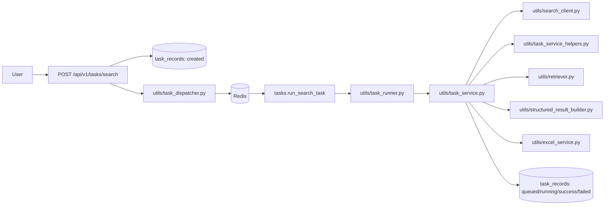

# rebuild_agent

一个基于 FastAPI 的结构化联网搜索服务。用户提交自然语言查询后，API 负责创建任务并入队，Celery worker 负责执行搜索、结构化整理和 Excel 导出，最终通过任务接口查询状态与结果。

## 当前状态

- 任务受理链路已经切到 `create -> queued -> worker -> running -> success/failed`
- 搜索结果经过统一清洗、top-k 选择、候选映射后再进入结构化阶段
- 结构化阶段已恢复真实 `prompt + llm + parser` 实现
- 结构化失败或返回空结果时，会回退到候选结果生成 fallback 输出
- `pytest` 当前通过：`26 passed`

## 技术栈

- Web：FastAPI + Uvicorn
- 任务调度：Celery + Redis
- 数据库：PostgreSQL + SQLAlchemy Async + Alembic + asyncpg
- 搜索：DuckDuckGo HTML / Sogou HTML + `httpx` + `lxml`
- 结构化抽取：LangChain + OpenAI Compatible Chat API + Pydantic
- 导出：Pandas + OpenPyXL
- 日志：Loguru
- 测试：Pytest + Pytest-Asyncio

## 核心流程

```text
POST /api/v1/tasks/search
-> create task record(status=created)
-> dispatch to Celery
-> update status=queued
-> return 202

Celery worker
-> consume tasks.run_search_task
-> update status=running
-> search_web
-> select_top_k_results / build_candidates
-> build_rebuild_prompt_input
-> build_structured_results
-> export_results_to_excel
-> update final status and result payload
```



## 主要模块

- `main.py`：应用入口、生命周期、全局异常处理
- `routers/task_router.py`：创建任务、查询任务详情
- `conf/celery_app.py`：Celery 应用初始化
- `tasks.py`：Celery task 注册入口
- `utils/task_dispatcher.py`：任务入队与 dispatch 元数据封装
- `utils/task_runner.py`：worker 侧执行入口
- `utils/task_service.py`：搜索、结构化、导出和状态更新主编排
- `utils/task_service_helpers.py`：文本清洗、top-k、候选映射、fallback、结果拼装
- `utils/search_client.py`：联网搜索 provider
- `utils/retriever.py`：二阶段结构化输入重建
- `utils/structured_result_builder.py`：LLM 结构化抽取
- `utils/task_presenter.py`：数据库记录转接口模型
- `schemas/search_schema.py`：搜索请求、搜索结果、候选结果、结构化结果
- `schemas/task_schema.py`：任务状态和任务接口返回模型
- `schemas/task_dispatch_schema.py`：dispatcher 边界模型

## API

### 创建任务

`POST /api/v1/tasks/search`

请求体位置：`schemas/search_schema.py`

```json
{
  "query": "大模型应用架构设计",
  "max_results": 5
}
```

成功响应现在返回 `queued`，而不是旧的 `pending`：

```json
{
  "success": true,
  "message": "success",
  "data": {
    "task_id": "a1b2c3d4",
    "query": "大模型应用架构设计",
    "status": "queued",
    "total_items": 0,
    "excel_path": null,
    "preview_items": [],
    "result_items": [],
    "message": "任务已排队",
    "error": null
  }
}
```

### 查询任务

`GET /api/v1/tasks/{task_id}`

成功后可拿到：

- `status`
- `preview_items`
- `result_items`
- `excel_path`
- `error`

## 目录结构

```text
rebuild_agent/
├─ main.py
├─ tasks.py
├─ conf/
├─ crud/
├─ models/
├─ routers/
├─ schemas/
├─ utils/
├─ tests/
├─ docs/
├─ scripts/
├─ alembic/
├─ outputs/
├─ storage/
├─ docker-compose.yml
└─ pyproject.toml
```

## 环境变量

复制环境变量文件：

```bash
# macOS / Linux
cp .env.example .env

# Windows PowerShell
Copy-Item .env.example .env
```

关键配置：

- `DATABASE_URL`：PostgreSQL 连接串
- `CELERY_BROKER_URL`：Celery broker，默认 Redis `0` 号库
- `CELERY_RESULT_BACKEND`：Celery backend，默认 Redis `1` 号库
- `DASHSCOPE_API_KEY`：结构化抽取使用的模型 API Key
- `LLM_BASE_URL` / `LLM_MODEL_NAME`：OpenAI Compatible 模型配置
- `STRUCTURED_STAGE_TIMEOUT_SECONDS`：结构化阶段超时
- `SEARCH_PROVIDER`：`duckduckgo_html` 或 `sogou_html`

`.env.example` 中已经包含上述默认项。

## 本地启动

### 1. 安装依赖

```bash
uv sync
uv sync --group dev
```

### 2. 初始化数据库

```bash
uv run alembic upgrade head
```

### 3. 启动 Redis

本地需要一个可用的 Redis 实例，默认地址：

```text
redis://127.0.0.1:6379/0
redis://127.0.0.1:6379/1
```

### 4. 启动 Celery worker

Windows 本地开发请使用 `solo` pool，避免 `billiard` 进程池权限错误：

```powershell
uv run celery -A conf.celery_app:celery_app worker --pool=solo --loglevel=INFO -Q search_queue
```

macOS / Linux 可继续使用默认 pool：

```bash
uv run celery -A conf.celery_app:celery_app worker --loglevel=INFO -Q search_queue
```

### 5. 启动 API

```bash
uv run uvicorn main:app --reload --host 127.0.0.1 --port 8000
```

## Docker Compose

当前 `docker-compose.yml` 已包含：

- `app`
- `worker`
- `db`
- `redis`

启动：

```bash
docker compose up --build
```

## 测试

运行测试：

```bash
uv run pytest
```

当前覆盖：

- 根路由与健康检查
- 创建任务与查询任务接口
- 请求参数校验与全局异常处理
- 搜索结果解析
- 任务编排成功/失败/降级路径
- Excel 导出

## 已知限制

- 搜索仍以 HTML 解析为主，稳定性弱于商业搜索 API
- 结构化输入仍主要来自标题与 snippet，尚未接入正文抓取
- `TaskStatus` 中已预留 `partial_success / timeout / retrying / cancelled`，但当前主链路还未完全用起来
- 暂未提供任务列表、取消、重试接口
- 阶段时间戳 schema 已存在，但主链路尚未完整持久化这些时间字段

## 后续方向

- 补全任务列表、取消、重试接口
- 把阶段时间戳和 `attempt_count / used_fallback / result_quality` 真正落库
- 引入更稳定的搜索 provider 或做多源 aggregation
- 增加正文抓取、字段来源追踪和质量分级
- 接入指标、队列监控和告警
