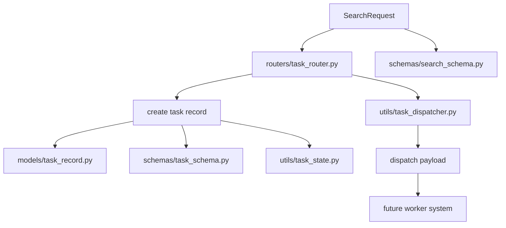

# Day 1：任务状态机与派发边界重构

## 今天的总目标

- 不再把这个项目理解成“一个接口加一个 `BackgroundTasks`”
- 开始把它重构成“API 受理层 + 任务记录层 + 执行派发层”的任务系统
- 让系统先具备清晰状态语义，再去接 Celery 和多队列

## 今天结束前，你必须拿到什么

- `schemas/task_schema.py` 里更完整的 `TaskStatus`
- `schemas/task_dispatch_schema.py`
- `models/task_record.py` 里更完整的任务字段设计思路
- `utils/task_state.py`
- `utils/task_dispatcher.py`
- 一套你能自己复述的 `create record -> enqueue -> run -> finalize` 理解框架

---

## Day 1 一图总览

如果把 Day 1 压缩成一句话，它做的就是：

> 先把任务系统的“状态和边界”讲清楚，而不是急着把执行器换成 Celery。

今天的主链路可以先背成这样：

```text
POST /tasks/search
-> validate request
-> create task record
-> set initial state
-> build dispatch payload
-> hand off to dispatcher
-> return 202
```

你今天要特别清楚：

- Day 1 的重点不是“任务已经稳定执行”
- Day 1 的重点是“系统终于知道自己处于什么状态”

---

## 为什么 Day 1 也要重构

当前项目虽然已经能跑，但它还处在非常典型的原型期：

- 路由层直接感知后台执行
- 任务状态只有 `pending / running / success / failed`
- 没有 `queued / retrying / timeout / partial_success / empty_result`
- 任务记录还不够表达“执行过程”

但后面你要做的是：

```text
BackgroundTasks
-> Celery
-> timeout / retry
-> retry API
-> observability
```

如果 Day 1 不先把状态机和派发边界定住，Day 2 开始你会一路边写边返工。

所以 Day 1 的一句话重构目标就是：

> 先把“任务是什么、状态怎么流动、谁负责派发”固定下来。

---

## Day 1 整体架构



### 你要怎么理解这张图

#### 第 1 层：接口受理层

这一层负责：

- 接收请求
- 校验参数
- 返回受理结果

它不应该负责：

- 直接执行完整任务
- 直接定义复杂状态迁移规则
- 把后台执行细节散落到路由里

#### 第 2 层：任务记录层

这一层负责：

- 给任务一个稳定主键
- 给任务一个稳定状态
- 给任务补充阶段时间戳与重试元数据

白话理解：

- 没有记录层，就没有可靠的任务系统
- 没有完整状态字段，后面所有“重试、排障”都站不住

#### 第 3 层：派发边界层

这一层负责：

- 把“我要执行这个任务”包装成统一动作
- 对外隔离 `BackgroundTasks` 或未来的 Celery

今天不要把重点误判成：

- “先把 Celery 接上”

今天真正的重点是：

- “先别让路由直接依赖具体执行器”

---

## 今天的边界要讲透

## 第 1 层：Day 1 不是 Day 2 的缩水版

今天不是“先接一点 Celery，明天再补完”。

今天真正做的是：

- 固定状态机
- 固定任务字段
- 固定派发抽象

这样明天 Celery 才有稳定挂载点。

## 第 2 层：Day 1 不是数据库字段堆砌

如果今天只是往表里多塞几个字段：

- `queued_at`
- `attempt_count`
- `error_code`

但你没有讲清：

- 这些字段什么时候更新
- 哪些状态允许迁移
- 哪些状态已经结束

那这些字段后面只会成为脏数据来源。

## 第 3 层：Day 1 不是直接升级执行可靠性

今天你还不会真正解决：

- 服务重启导致任务丢失
- worker 崩溃导致任务悬挂
- 多实例并发消费

这些是 Day 2 的事情。

今天只做一个更基础但更关键的动作：

- 给 Day 2 准备正确的接口与状态语义

## 第 4 层：Day 1 的返回值仍然是“受理成功”

今天你要非常克制：

- `202 Accepted` 只代表任务已受理并准备派发
- 不代表任务已经执行成功

所以今天最重要的语义区分是：

- “创建任务”
- “任务已排队”
- “任务正在运行”

---

## 上午学习：09:00 - 12:00

## 09:00 - 09:50：先把任务主链路讲顺

今天你必须能顺着说出来：

```text
request
-> validate
-> create task_id
-> persist task record
-> set initial status
-> build enqueue payload
-> call dispatcher
-> return 202
```

你今天必须能回答这两个问题：

1. 为什么 `task_router.py` 不应该直接知道未来 Celery 的细节？
2. 为什么 `queued` 不能继续混在 `pending` 里面？

## 09:50 - 10:40：先想清楚最小状态机

今天建议先补到这些状态：

- `created`
- `queued`
- `running`
- `partial_success`
- `success`
- `failed`
- `timeout`
- `retrying`
- `empty_result`

这里最重要的是：

- `partial_success` 和 `empty_result` 不能偷懒都压成 `success`

## 10:40 - 11:20：把“任务记录里什么一定要落库”想清楚

今天建议你至少明确这些字段：

- `task_id`
- `query`
- `status`
- `attempt_count`
- `queued_at`
- `started_at`
- `finished_at`
- `search_finished_at`
- `llm_finished_at`
- `export_finished_at`
- `error_code`
- `error_message`
- `used_fallback`
- `result_quality`

最重要的是：

- 字段不是为了“好看”
- 字段是为了后面支撑状态迁移、接口展示和排障

## 11:20 - 12:00：先决定今天怎么验收

Day 1 的最小验收目标：

- 路由层不再直接耦合具体后台执行技术
- 状态机已经覆盖后续 Phase 1 和 Phase 3 的需要
- 任务记录设计已经能表达“执行过程”
- 你能清楚解释哪些状态是终态，哪些不是

---

## 下午编码：14:00 - 18:00

## 14:00 - 14:40：先补 `schemas/task_schema.py`

今天你先改的不是执行器，而是任务契约。

建议你先把：

- `TaskStatus`
- `TaskItem`

这两个地方补完整。

建议新增字段：

- `attempt_count`
- `used_fallback`
- `result_quality`
- `warnings`

### `schemas/task_schema.py` 练手骨架版

```python
from enum import StrEnum

from pydantic import BaseModel, Field


class TaskStatus(StrEnum):
    # 你要做的事：
    # 1. 补全任务全生命周期状态
    # 2. 不要只保留 pending / running / success / failed
    raise NotImplementedError


class TaskItem(BaseModel):
    task_id: str
    query: str = ""
    status: TaskStatus
    total_items: int = 0
    excel_path: str | None = None

    # 你要做的事：
    # 1. 增加 attempt_count
    # 2. 增加 used_fallback
    # 3. 增加 result_quality
    # 4. 增加 warnings
    # 5. 先保持对当前接口的兼容思路
```

### `schemas/task_schema.py` 参考答案

```python
from enum import StrEnum

from pydantic import BaseModel, Field


class TaskStatus(StrEnum):
    CREATED = "created"
    QUEUED = "queued"
    RUNNING = "running"
    PARTIAL_SUCCESS = "partial_success"
    SUCCESS = "success"
    FAILED = "failed"
    TIMEOUT = "timeout"
    RETRYING = "retrying"
    EMPTY_RESULT = "empty_result"


class TaskItem(BaseModel):
    task_id: str
    query: str = ""
    status: TaskStatus = TaskStatus.CREATED
    total_items: int = 0
    excel_path: str | None = None
    attempt_count: int = 0
    used_fallback: bool = False
    result_quality: str = "unknown"
    warnings: list[str] = Field(default_factory=list)
```

## 14:40 - 15:30：补一个独立的 `utils/task_state.py`

今天很建议你新建一个小模块，把状态规则收口。

建议新增：

- `utils/task_state.py`

这个模块不是为了显得“设计高级”，而是为了避免你后面把状态规则散到：

- `routers/task_router.py`
- `crud/task_record_crud.py`
- `utils/task_service.py`

### `utils/task_state.py` 练手骨架版

```python
from schemas.task_schema import TaskStatus


def is_terminal_status(status: str) -> bool:
    # 你要做的事：
    # 1. 判断哪些状态已经结束
    # 2. 终态不能再继续推进
    raise NotImplementedError


def can_transition(from_status: str, to_status: str) -> bool:
    # 你要做的事：
    # 1. 定义合法状态迁移
    # 2. 防止 running -> created 这种回退
    # 3. 防止 success 后继续进入 running
    raise NotImplementedError
```

### `utils/task_state.py` 参考答案

```python
from schemas.task_schema import TaskStatus


TERMINAL_STATUSES = {
    TaskStatus.PARTIAL_SUCCESS,
    TaskStatus.SUCCESS,
    TaskStatus.FAILED,
    TaskStatus.TIMEOUT,
    TaskStatus.EMPTY_RESULT,
}


def is_terminal_status(status: str) -> bool:
    return status in {str(item) for item in TERMINAL_STATUSES}


def can_transition(from_status: str, to_status: str) -> bool:
    allowed = {
        TaskStatus.CREATED: {TaskStatus.QUEUED, TaskStatus.FAILED},
        TaskStatus.QUEUED: {TaskStatus.RUNNING, TaskStatus.TIMEOUT},
        TaskStatus.RUNNING: {
            TaskStatus.SUCCESS,
            TaskStatus.PARTIAL_SUCCESS,
            TaskStatus.EMPTY_RESULT,
            TaskStatus.FAILED,
            TaskStatus.TIMEOUT,
            TaskStatus.RETRYING,
        },
        TaskStatus.RETRYING: {TaskStatus.QUEUED, TaskStatus.FAILED, TaskStatus.TIMEOUT},
    }
    return to_status in {str(item) for item in allowed.get(from_status, set())}
```

## 15:30 - 16:20：补 `utils/task_dispatcher.py`

今天这个文件最重要的价值不是功能有多强，而是它会成为 Day 2 的挂载点。

在更工程化的写法里，这里不要把 `DispatchPayload`、`DispatchResult` 直接写在 `utils/task_dispatcher.py` 里。

建议新增：

- `schemas/task_dispatch_schema.py`

先把派发边界类型放到 `schemas/`，再让 dispatcher 去 import。

### `schemas/task_dispatch_schema.py` 练手骨架版

```python
from typing import Literal

from pydantic import BaseModel


class DispatchPayload(BaseModel):
    # 你要做的事：
    # 1. 描述最小派发载荷
    # 2. 至少包含 task_id / query / max_results / dispatch_version
    raise NotImplementedError


class DispatchResult(BaseModel):
    # 你要做的事：
    # 1. 描述派发结果
    # 2. 至少包含 accepted / task_id / dispatch_mode / request_payload
    # 3. 允许为后续 Celery 场景预留 queue / celery_task_id
    raise NotImplementedError
```

### `schemas/task_dispatch_schema.py` 参考答案

```python
from typing import Literal

from pydantic import BaseModel


class DispatchPayload(BaseModel):
    task_id: str
    query: str
    max_results: int
    submitted_at: str
    dispatch_version: Literal["v1"] = "v1"


class DispatchResult(BaseModel):
    accepted: bool
    task_id: str
    dispatch_mode: str
    request_payload: DispatchPayload
    queue: str = ""
    celery_task_id: str = ""
```

### `utils/task_dispatcher.py` 练手骨架版

```python
from __future__ import annotations

from schemas.search_schema import SearchRequest
from schemas.task_dispatch_schema import DispatchPayload, DispatchResult


def build_enqueue_payload(task_id: str, request: SearchRequest) -> DispatchPayload:
    # 你要做的事：
    # 1. 构造最小派发载荷
    # 2. 对外参数先用 SearchRequest
    # 3. 真正要发往队列时，再在函数内部转成可序列化 payload
    # 4. 至少保留 task_id / query / max_results / dispatch_version
    raise NotImplementedError


async def dispatch_task(task_id: str, request: SearchRequest) -> DispatchResult:
    # 你要做的事：
    # 1. 先定义统一派发接口
    # 2. 当前可以先兼容旧执行方式
    # 3. 但不要让 router 直接知道后台执行细节
    raise NotImplementedError
```

### `utils/task_dispatcher.py` 参考答案

```python
from __future__ import annotations

from datetime import datetime, timezone

from schemas.search_schema import SearchRequest
from schemas.task_dispatch_schema import DispatchPayload, DispatchResult


def build_enqueue_payload(task_id: str, request: SearchRequest) -> DispatchPayload:
    return DispatchPayload(
        task_id=task_id,
        query=request.query,
        max_results=request.max_results,
        submitted_at=datetime.now(timezone.utc).isoformat(),
        dispatch_version="v1",
    )


async def dispatch_task(task_id: str, request: SearchRequest) -> DispatchResult:
    enqueue_payload = build_enqueue_payload(task_id, request)
    return DispatchResult(
        accepted=True,
        task_id=task_id,
        dispatch_mode="background_tasks_compatible",
        request_payload=enqueue_payload,
        queue="",
        celery_task_id="",
    )
```

## 16:20 - 17:10：把 `routers/task_router.py` 改成“只负责编排受理”

今天你要强迫自己守住一个边界：

- 路由层只负责受理
- 不负责执行细节

所以它的动作应该变成：

1. 校验 `SearchRequest`
2. 创建任务记录
3. 调 dispatcher
4. 返回 `202`

而不是：

1. 创建任务
2. 立刻把某种后台执行技术写死在路由层

## 17:10 - 18:00：顺手把模型字段方案写进 `models/task_record.py`

今天你不一定要把所有数据库迁移都真正执行完，但你必须把字段方案讲透。

建议你在 `models/task_record.py` 至少明确：

- 哪些是基础字段
- 哪些是阶段时间字段
- 哪些是质量字段
- 哪些是错误字段

---

## 晚上复盘：20:00 - 21:00

今晚你必须自己讲顺的 8 个点：

1. 为什么 `queued` 不能继续藏在 `pending` 里？
2. 为什么状态迁移规则应该集中管理？
3. 为什么 Day 1 不应该直接把 Celery 写死进路由？
4. `partial_success` 和 `empty_result` 的差别是什么？
5. 为什么 `attempt_count` 和阶段时间戳值得落库？
6. 终态和非终态怎么区分？
7. 为什么派发抽象要先于执行器替换？
8. Day 1 和 Day 2 的边界到底是什么？

---

## 今日验收标准

- `TaskStatus` 已覆盖后续工程化需要
- 项目中已经出现状态规则收口位置
- 路由层和具体执行器之间已经有抽象边界
- 任务记录字段设计已经不再停留在原型级
- 你能清楚讲出 Day 1 的主链路

---

## 今天最容易踩的坑

### 坑 1：把 Day 1 误做成“先偷接一点 Celery”

问题：

- 你会一边写执行器，一边返工状态机

规避建议：

- 先把状态机和派发边界定住

### 坑 2：只加状态枚举，不加迁移规则

问题：

- 状态会在多个模块里各写一套

规避建议：

- 至少收口一个 `task_state.py`

### 坑 3：把“结果质量”和“执行状态”混成一类

问题：

- 后面很难区分 `partial_success` 与 `success`

规避建议：

- 明确哪些状态反映执行过程，哪些字段反映结果质量

### 坑 4：派发抽象写成空壳但没有真实职责

问题：

- 到了 Day 2 还是得回头重构

规避建议：

- 让它至少承载统一入队载荷和统一派发返回值

---

## 给明天的交接提示

明天你会进入真正的执行层替换：

- 怎么把 `BackgroundTasks` 迁出主链路
- 怎么把任务交给 Redis + Celery
- 怎么把 `queued -> running -> finalize` 跑通

所以 Day 1 的意义是：

> 先让系统知道自己是什么任务系统，再去让它变成可靠任务系统。
