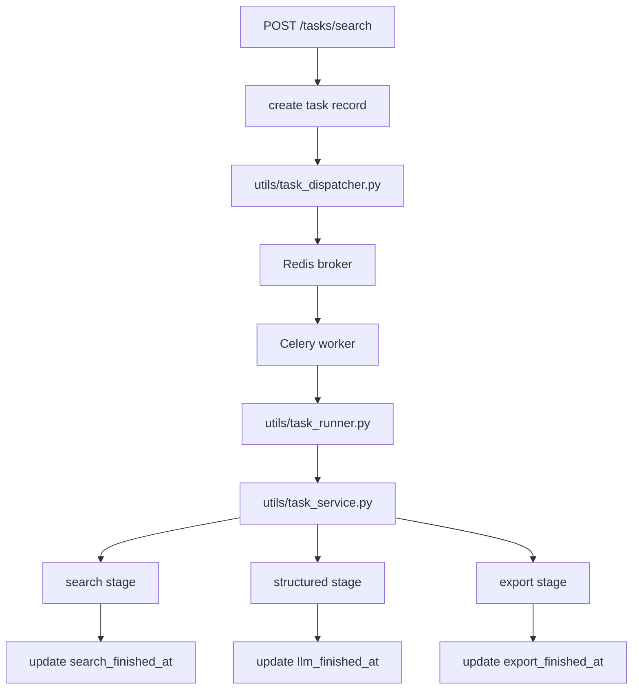

# Day 2：Celery 接入与执行链路解耦

## 今天的总目标

- 不再让 FastAPI 进程内的 `BackgroundTasks` 充当真正的执行系统
- 开始把任务执行迁到 Redis + Celery worker
- 让“API 受理”和“后台执行”彻底分层

## 今天结束前，你必须拿到什么

- `conf/celery_app.py`
- `schemas/task_dispatch_schema.py`
- `schemas/task_runtime_schema.py`
- `utils/task_runner.py` 的 worker 化入口设计
- `utils/task_dispatcher.py` 的 Celery 派发能力
- `docker-compose.yml` 中 Redis 与 worker 的接入思路
- 一套你能自己复述的 `create -> queued -> worker consume -> stage run -> finalize` 理解框架

---

## Day 2 一图总览

如果把 Day 2 压缩成一句话，它做的就是：

> 把“任务受理”和“任务执行”真正拆开，让 API 只负责接单，worker 才负责做事。

今天的主链路可以先背成这样：

```text
POST /tasks/search
-> create task record
-> dispatcher.enqueue(...)
-> status=queued
-> celery worker consume
-> run search task
-> update stage timestamps
-> persist final status
```

你今天要特别清楚：

- Day 1 的重点是状态和边界
- Day 2 的重点是执行系统真正落地

---

## 为什么 Day 2 也要重构

当前项目的执行方式是：

```text
router
-> BackgroundTasks
-> execute_task_by_id
-> run_search_task
```

这条链路的问题非常典型：

- 服务重启会丢任务
- 没有统一重试模型
- 没有真正的队列状态
- 多实例下不可靠
- 搜索、LLM、导出无法隔离资源

所以 Day 2 的一句话重构目标就是：

> 让任务执行成为一个独立运行时，而不是 Web 请求生命周期的附属品。

---

## Day 2 整体架构



### 你要怎么理解这张图

#### 第 1 层：API 受理层

这一层负责：

- 接收请求
- 写任务记录
- 入队
- 返回 `202`

这一层不应该负责：

- 真正执行搜索
- 执行 LLM 抽取
- 执行导出

#### 第 2 层：队列运行时层

这一层负责：

- 接收消息
- 把任务送给 worker
- 隔离 Web 进程与执行进程

白话理解：

- API 是前台
- Celery worker 才是后台真正干活的人

#### 第 3 层：任务编排层

这一层负责：

- 搜索
- 结构化
- 导出
- 阶段状态更新

这层依然主要落在：

- `utils/task_service.py`
- `utils/task_runner.py`

但它现在要服务于 worker，而不是服务于 `BackgroundTasks`

---

## 今天的边界要讲透

## 第 1 层：Day 2 不是“只是把函数换个调用位置”

如果你只是把：

- `background_tasks.add_task(...)`

换成：

- `celery_app.send_task(...)`

但你没有重新定义：

- 入队成功语义
- worker 入口语义
- 重试与超时规则

那 Day 2 其实没有真正完成。

## 第 2 层：Day 2 不是把所有逻辑塞进 Celery task

今天你不要把 Celery 当成“巨型胶水层”。

Celery 负责任务运行时。

真正的业务编排仍然应该尽量放在：

- `utils/task_service.py`

这样后面测试、调试和替换都会更容易。

## 第 3 层：Day 2 不是先把高级特性全做完

今天你不一定要一次完成：

- 死信队列
- 分布式 tracing
- Prometheus 指标

今天最小但关键的目标是：

- API 成功入队才返回 `202`
- worker 能独立执行
- 阶段时间戳开始真正更新
- retry / timeout 至少有第一版规则

## 第 4 层：Day 2 的重点不是“接了 Redis”

Redis 只是工具。

今天真正完成的标志是：

- 系统的执行责任已经从 Web 进程迁走

---

## 上午学习：09:00 - 12:00

## 09:00 - 09:50：先把新版执行主链路讲顺

今天你必须能顺着说出来：

```text
request
-> create record
-> enqueue
-> queued
-> worker consume
-> running
-> stage finish
-> success / partial_success / failed / timeout
```

你今天必须能回答这两个问题：

1. 为什么 `202 Accepted` 只能在“写库成功且入队成功”之后返回？
2. 为什么 `task_runner.py` 更适合作为 worker 入口而不是路由辅助函数？

## 09:50 - 10:40：先想清楚 Day 2 最小运行时结构

今天建议你最少想清：

- broker：Redis
- Celery app 在哪里初始化
- 哪个 task 名称负责执行主链路
- 哪些阶段将来要拆成独立 queue

第一版建议至少先有：

- `search_queue`
- `llm_queue`
- `export_queue`

## 10:40 - 11:20：先决定什么错误能重试

今天你最容易模糊的点是：

- 不是所有失败都应该 retry

建议第一版先把这些视为可重试：

- 搜索超时
- 临时网络错误
- LLM 上游超时

不要一开始就对这些直接无限重试：

- schema 结构错误
- 明显业务脏数据
- 已知不可恢复的逻辑错误

## 11:20 - 12:00：先决定今天怎么验收

Day 2 的最小验收目标：

- `BackgroundTasks` 已不再是主执行方案
- worker 能独立跑通一次主链路
- API 只有在真正入队成功后才返回 `202`
- 任务至少开始具备 `queued / running / final` 的真实执行语义

---

## 下午编码：14:00 - 18:00

## 14:00 - 14:40：先落 `conf/celery_app.py`

今天建议先做一个最小但干净的 Celery 配置入口。

建议新增：

- `conf/celery_app.py`

### `conf/celery_app.py` 练手骨架版

```python
from celery import Celery


def build_celery_app() -> Celery:
    # 你要做的事：
    # 1. 读取 broker / backend 配置
    # 2. 初始化 Celery
    # 3. 配置默认 queue 和 task route
    # 4. 配置 time limit / retry 相关参数
    raise NotImplementedError


celery_app = build_celery_app()
```

### `conf/celery_app.py` 参考答案

```python
from celery import Celery


def build_celery_app() -> Celery:
    app = Celery(
        "rebuild_agent",
        broker="redis://127.0.0.1:6379/0",
        backend="redis://127.0.0.1:6379/1",
    )
    app.conf.update(
        task_default_queue="search_queue",
        task_routes={
            "tasks.run_search_task": {"queue": "search_queue"},
        },
        task_track_started=True,
        task_time_limit=90,
        task_soft_time_limit=75,
        task_acks_late=True,
    )
    return app


celery_app = build_celery_app()
```

## 14:40 - 15:30：改 `utils/task_dispatcher.py`

今天你要把 dispatcher 从“概念层”变成“真正入队层”。

这里继续沿用 Day 1 的规则：

- `DispatchResult` 不要定义在 `utils/`
- 放到 `schemas/task_dispatch_schema.py`

### `utils/task_dispatcher.py` 练手骨架版

```python
from __future__ import annotations

from schemas.search_schema import SearchRequest
from schemas.task_dispatch_schema import DispatchResult


def get_queue_name(stage: str) -> str:
    # 你要做的事：
    # 1. search -> search_queue
    # 2. llm -> llm_queue
    # 3. export -> export_queue
    raise NotImplementedError


async def dispatch_search_task(task_id: str, request: SearchRequest) -> DispatchResult:
    # 你要做的事：
    # 1. 用 celery_app 投递任务
    # 2. 对外参数优先使用 SearchRequest，而不是裸 dict
    # 3. 在函数内部再转成 request.model_dump(...)
    # 4. 返回任务调度元数据
    # 5. 保持 router 不直接依赖 Celery 细节
    raise NotImplementedError
```

### `utils/task_dispatcher.py` 参考答案

```python
from __future__ import annotations

from conf.celery_app import celery_app
from schemas.search_schema import SearchRequest
from schemas.task_dispatch_schema import DispatchResult


QUEUE_BY_STAGE = {
    "search": "search_queue",
    "llm": "llm_queue",
    "export": "export_queue",
}


def get_queue_name(stage: str) -> str:
    return QUEUE_BY_STAGE.get(stage, "search_queue")


async def dispatch_search_task(task_id: str, request: SearchRequest) -> DispatchResult:
    result = celery_app.send_task(
        "tasks.run_search_task",
        kwargs={
            "task_id": task_id,
            "request_payload": request.model_dump(mode="json"),
        },
        queue=get_queue_name("search"),
    )
    return DispatchResult(
        accepted=True,
        task_id=task_id,
        dispatch_mode="celery",
        request_payload={
            "task_id": task_id,
            "query": request.query,
            "max_results": request.max_results,
            "submitted_at": "",
            "dispatch_version": "v1",
        },
        queue=get_queue_name("search"),
        celery_task_id=str(result.id),
    )
```

## 15:30 - 16:20：把 `utils/task_runner.py` 变成 worker 入口

这一步最重要的是让它从：

- “被 FastAPI 背景任务调用”

变成：

- “被 Celery worker 调用”

### `utils/task_runner.py` 练手骨架版

```python
from __future__ import annotations

from sqlalchemy.ext.asyncio import AsyncSession

from schemas.search_schema import SearchRequest


async def execute_task_by_id(task_id: str, request: SearchRequest) -> None:
    # 你要做的事：
    # 1. worker 入口优先接收 SearchRequest 这样的明确类型
    # 2. 如果消息队列层传来 dict，就在更外层先 model_validate 成 SearchRequest
    # 3. 创建独立 DB session
    # 4. 调 run_search_task(...)
    # 5. 异常时更新失败状态
    raise NotImplementedError
```

### `utils/task_runner.py` 参考答案

```python
from __future__ import annotations

from conf.db_conf import AsyncSessionLocal
from schemas.search_schema import SearchRequest
from utils.task_service import run_search_task


async def execute_task_by_id(task_id: str, request: SearchRequest) -> None:
    async with AsyncSessionLocal.begin() as db:  # type: AsyncSession
        await run_search_task(task_id=task_id, request=request, db=db)
```

## 16:20 - 17:00：在 `utils/task_service.py` 开始补阶段时间更新

今天建议你至少开始明确这几个时机：

- 进入执行时：`started_at`
- 搜索完成时：`search_finished_at`
- 结构化完成时：`llm_finished_at`
- 导出完成时：`export_finished_at`
- 全部结束时：`finished_at`

这类“阶段补丁类型”也建议不要直接写在 `utils/task_service.py` 里。

建议新增：

- `schemas/task_runtime_schema.py`

### `schemas/task_runtime_schema.py` 练手骨架版

```python
from datetime import datetime

from pydantic import BaseModel


class StageTimestampPatch(BaseModel):
    # 你要做的事：
    # 1. 允许不同阶段只更新自己对应的 finished_at
    # 2. 字段要全部可选
    raise NotImplementedError
```

### `schemas/task_runtime_schema.py` 参考答案

```python
from datetime import datetime

from pydantic import BaseModel


class StageTimestampPatch(BaseModel):
    search_finished_at: datetime | None = None
    llm_finished_at: datetime | None = None
    export_finished_at: datetime | None = None
```

### `utils/task_service.py` 练手骨架版

```python
from datetime import datetime, timezone
from schemas.task_runtime_schema import StageTimestampPatch


def build_stage_update(stage: str) -> StageTimestampPatch:
    # 你要做的事：
    # 1. 根据阶段名返回不同 finished_at 字段
    # 2. 统一使用 UTC 时间
    raise NotImplementedError
```

### `utils/task_service.py` 参考答案

```python
from datetime import datetime, timezone
from schemas.task_runtime_schema import StageTimestampPatch


def build_stage_update(stage: str) -> StageTimestampPatch:
    now = datetime.now(timezone.utc)
    mapping = {
        "search": StageTimestampPatch(search_finished_at=now),
        "llm": StageTimestampPatch(llm_finished_at=now),
        "export": StageTimestampPatch(export_finished_at=now),
    }
    return mapping.get(stage, StageTimestampPatch())
```

## 17:00 - 17:40：改 `routers/task_router.py`

今天你要守住一个非常重要的语义：

- 只有写库成功且入队成功，才能回 `202`

也就是说：

- “只写库不入队”
- “入队抛异常”

都不能伪装成受理成功。

## 17:40 - 18:00：给本地运行环境留入口

今天建议顺手把这些接上：

- `docker-compose.yml` 增加 Redis
- 预留 worker 启动命令
- README 记录最小本地跑法

---

## 晚上复盘：20:00 - 21:00

今晚你必须自己讲顺的 8 个点：

1. 为什么 `BackgroundTasks` 不能继续做主执行器？
2. API 和 worker 的职责边界是什么？
3. 为什么入队失败时不能返回 `202`？
4. 为什么 `task_runner.py` 是一个运行时边界，而不是业务层？
5. 哪些错误适合重试，哪些不适合？
6. 为什么阶段时间戳值得从 Day 2 就开始做？
7. 多队列的价值是什么？
8. Day 2 和 Day 3 的边界到底是什么？

---

## 今日验收标准

- Celery 配置入口已经存在
- dispatcher 已具备真正入队能力
- worker 入口已不再依赖 `BackgroundTasks`
- 路由层 `202` 语义已收紧
- 执行链路已经能表达真实的 `queued -> running -> final`

---

## 今天最容易踩的坑

### 坑 1：只是把调用方式改成 Celery，没有重做语义

问题：

- 看起来升级了，实际上状态和职责还是旧的

规避建议：

- 同时改入队语义、worker 入口和阶段更新

### 坑 2：让 Celery task 直接承载全部业务逻辑

问题：

- 业务逻辑和运行时逻辑会混在一起

规避建议：

- 让 `task_service.py` 继续负责编排
- 让 `task_runner.py` 负责运行时边界

### 坑 3：没有条件更新和幂等保护意识

问题：

- 后面重试和重复消费会出问题

规避建议：

- 今天就开始考虑 `attempt_count` 和状态合法迁移

### 坑 4：所有任务都塞进同一个 queue

问题：

- 后面无法对搜索、LLM、导出做并发隔离

规避建议：

- 从第一版开始就保留队列拆分意识

---

## 给明天的交接提示

明天你会进入“结果质量控制”层：

- 搜索候选怎么去重
- 候选怎么评分和 rerank
- LLM 输出怎么不再那么黑盒

所以 Day 2 的意义是：

> 先让系统稳稳地跑起来，再去解决它跑出来的结果到底好不好。
