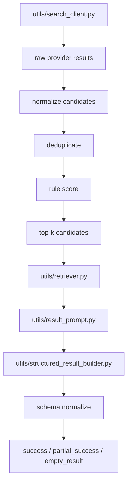

# Day 3：候选结果质量控制与结构化可靠性提升

## 今天的总目标

- 不再满足于“搜索有结果，LLM 也返回了点东西”
- 开始把候选质量治理和结构化约束真正接入主链路
- 让结果从“能看”走向“更可解释、更可控”

## 今天结束前，你必须拿到什么

- `schemas/search_schema.py`
- `utils/task_service_helpers.py` 或 `utils/candidate_organizer.py`
- `utils/result_prompt.py` 的更强约束版思路
- `utils/structured_result_builder.py` 的结果修正规则
- 一套你能自己复述的 `provider results -> dedup -> score -> top-k -> prompt -> parse -> validate` 理解框架

---

## Day 3 一图总览

如果把 Day 3 压缩成一句话，它做的就是：

> 先把送进 LLM 的候选集变干净，再把 LLM 的输出变得更受控。

今天的主链路可以先背成这样：

```text
search results
-> normalize candidate
-> deduplicate
-> score / rerank
-> choose top-k
-> build prompt input
-> llm structured output
-> schema normalize
-> fallback if needed
```

你今天要特别清楚：

- Day 2 的重点是“稳不稳”
- Day 3 的重点是“好不好”

---

## 为什么 Day 3 也要重构

当前项目虽然已经有：

- 搜索
- top-k
- 第二段结构化
- fallback

但它还存在几个典型问题：

- 候选结果统一结构不够强
- 去重还不够系统
- 评分还是偏原型级
- LLM 输出错误时语义不够细
- 结果来源和置信度不够清晰

所以 Day 3 的一句话重构目标就是：

> 不再让“原始搜索结果 + 黑盒 LLM”直接定义最终质量。

---

## Day 3 整体架构



### 你要怎么理解这张图

#### 第 1 层：候选治理层

这一层负责：

- 统一候选结构
- 去重
- 排序
- top-k 选择

白话理解：

- LLM 不应该吃所有原始结果
- LLM 只应该吃最值得吃的那一小批候选

#### 第 2 层：结构化输入层

这一层负责：

- 压缩上下文
- 保留关键信息
- 控制长度

这里的重点是：

- 提示词不是在“拯救烂候选”
- 提示词是在“整合已经相对干净的候选”

#### 第 3 层：结构化输出层

这一层负责：

- 解析模型输出
- 修正常见字段问题
- 记录 warning
- 触发 fallback

---

## 今天的边界要讲透

## 第 1 层：Day 3 不是单纯再接一个 rerank 模型

很多人一说结果质量，就直接想到：

- “上 embedding rerank”
- “上 LLM rerank”

但在你这个项目里，今天更关键的是：

- 统一 candidate 结构
- 建立规则打分
- 做最基础但稳定的去重

也就是说：

- Day 3 的第一优先级是可解释治理
- 不是先堆更重的模型

## 第 2 层：Day 3 不是只调 prompt

如果你今天只改 `utils/result_prompt.py`：

- 候选还是脏的
- 重复来源还是多
- snippet 还是可能误导

那 LLM 仍然是在不稳定输入上勉强发挥。

## 第 3 层：Day 3 不是让 fallback 消失

今天不是要做到：

- “以后永远不 fallback”

今天真正要做到的是：

- 正常结构化成功时更可靠
- fallback 发生时语义更明确
- 调用方能区分正常结果和降级结果

## 第 4 层：Day 3 的结果必须更可解释

今天至少应该让系统逐步能回答：

- 这个结果来自哪个候选
- 这个结果质量大概怎样
- 有没有发生 fallback
- 为什么这条结果进入了 top-k

---

## 上午学习：09:00 - 12:00

## 09:00 - 09:50：先把 Day 3 主链路讲顺

今天你必须能顺着说出来：

```text
provider results
-> candidate normalization
-> dedup
-> scoring
-> top-k
-> prompt input
-> llm parse
-> validate
-> fallback if needed
```

你今天必须能回答这两个问题：

1. 为什么“provider 返回 5 条结果”不等于“候选集质量已经合格”？
2. 为什么结构化输出错误时不能都简单算作 `success`？

## 09:50 - 10:40：先决定最小 candidate 模型

今天建议你至少明确这些字段：

- `candidate_id`
- `title`
- `url`
- `domain`
- `provider`
- `rank_raw`
- `summary`
- `score_rule`
- `score_final`

这里最重要的是：

- 后面所有去重、评分、来源追踪都依赖统一 candidate 结构

## 10:40 - 11:20：先决定最小质量规则

今天建议你先做这些低成本规则：

- URL 精确去重
- 域名限流
- query 词覆盖率
- 标题命中加分
- 来源存在性加分

这里最重要的是：

- 规则一定要先可解释
- 不要一开始就把排序完全黑盒化

## 11:20 - 12:00：先决定今天怎么验收

Day 3 的最小验收目标：

- 候选结果有统一模型
- 有去重逻辑
- 有一版可解释评分
- 结构化结果至少开始带 warning / 来源意识
- `success / partial_success / empty_result` 的语义比之前清楚

---

## 下午编码：14:00 - 18:00

## 14:00 - 14:40：先补 `schemas/search_schema.py`

今天建议你先把候选和结构化结果模型补强。

### `schemas/search_schema.py` 练手骨架版

```python
from pydantic import BaseModel, Field


class CandidateResultItem(BaseModel):
    candidate_id: str
    title: str
    url: str

    # 你要做的事：
    # 1. 增加 domain
    # 2. 增加 provider
    # 3. 增加 rank_raw
    # 4. 增加 score_rule / score_final
    # 5. 保持和当前项目的候选职责一致


class StructuredResultItem(BaseModel):
    query: str
    title: str
    source: str
    url: str

    # 你要做的事：
    # 1. 增加 confidence
    # 2. 增加 source_candidate_id
    # 3. 增加 warnings
```

### `schemas/search_schema.py` 参考答案

```python
from pydantic import BaseModel, Field


class CandidateResultItem(BaseModel):
    candidate_id: str
    title: str
    url: str
    domain: str = ""
    provider: str = ""
    rank_raw: int = 0
    source: str = ""
    summary: str = ""
    extraction_notes: str = ""
    score_rule: float = 0.0
    score_final: float = 0.0


class StructuredResultItem(BaseModel):
    query: str
    title: str
    source: str
    url: str
    content_type: str = "unknown"
    region: str = "不限"
    role_direction: str = "通用"
    summary: str = ""
    quality_score: int = Field(default=60, ge=0, le=100)
    extraction_notes: str = ""
    confidence: float = 0.0
    source_candidate_id: str = ""
    warnings: list[str] = Field(default_factory=list)
```

## 14:40 - 15:30：重构 `utils/task_service_helpers.py`

今天建议你把候选治理逻辑从“混杂 helpers”逐步拆成更像能力链。

如果当前文件太重，也可以新增：

- `utils/candidate_organizer.py`

### `utils/task_service_helpers.py` 练手骨架版

```python
from urllib.parse import urlparse

from schemas.search_schema import CandidateResultItem


def deduplicate_candidates(items: list[CandidateResultItem]) -> list[CandidateResultItem]:
    # 你要做的事：
    # 1. 先按 URL 去重
    # 2. 再限制同域名结果数量
    # 3. 过滤明显空 title / empty url
    raise NotImplementedError


def score_candidate(query: str, item: CandidateResultItem) -> float:
    # 你要做的事：
    # 1. 做 query 词覆盖率计算
    # 2. 做标题命中加分
    # 3. 做来源质量基础加分
    raise NotImplementedError


def select_top_candidates(
    query: str,
    items: list[CandidateResultItem],
    *,
    top_k: int,
) -> list[CandidateResultItem]:
    # 你要做的事：
    # 1. 先 dedup
    # 2. 再 score
    # 3. 再排序截断
    raise NotImplementedError
```

### `utils/task_service_helpers.py` 参考答案

```python
from urllib.parse import urlparse

from schemas.search_schema import CandidateResultItem


def _normalize_url(url: str) -> str:
    return (url or "").strip().rstrip("/")


def _get_domain(url: str) -> str:
    return urlparse(url).netloc.lower()


def deduplicate_candidates(items: list[CandidateResultItem]) -> list[CandidateResultItem]:
    seen_urls: set[str] = set()
    domain_counter: dict[str, int] = {}
    deduped: list[CandidateResultItem] = []

    for item in items:
        if not item.title or not item.url:
            continue

        normalized_url = _normalize_url(item.url)
        if not normalized_url or normalized_url in seen_urls:
            continue

        domain = _get_domain(normalized_url)
        if domain and domain_counter.get(domain, 0) >= 2:
            continue

        seen_urls.add(normalized_url)
        domain_counter[domain] = domain_counter.get(domain, 0) + 1
        deduped.append(
            item.model_copy(
                update={
                    "url": normalized_url,
                    "domain": domain,
                }
            )
        )

    return deduped


def score_candidate(query: str, item: CandidateResultItem) -> float:
    terms = [term for term in query.lower().split() if term]
    haystack = f"{item.title} {item.summary}".lower()
    coverage = sum(term in haystack for term in terms) / len(terms) if terms else 0.0
    title_bonus = 0.2 if query.lower() in item.title.lower() else 0.0
    source_bonus = 0.1 if item.source and item.source != "unknown" else 0.0
    score = 0.5 * coverage + title_bonus + source_bonus
    return round(min(score, 0.99), 4)


def select_top_candidates(
    query: str,
    items: list[CandidateResultItem],
    *,
    top_k: int,
) -> list[CandidateResultItem]:
    deduped = deduplicate_candidates(items)
    ranked = [
        item.model_copy(
            update={
                "score_rule": score_candidate(query, item),
                "score_final": score_candidate(query, item),
            }
        )
        for item in deduped
    ]
    return sorted(ranked, key=lambda item: item.score_final, reverse=True)[:top_k]
```

## 15:30 - 16:10：改 `utils/retriever.py`

今天你要开始让“送给结构化阶段的输入”更克制。

重点是：

- 只传 top-k
- 带 `candidate_id`
- 控制摘要长度

不要再把所有候选都一股脑塞进 LLM。

## 16:10 - 16:50：改 `utils/result_prompt.py` 与 `utils/structured_result_builder.py`

今天 prompt 的重点不是“写得好看”，而是：

- 字段定义清楚
- 缺失策略清楚
- 禁止臆造清楚

### `utils/structured_result_builder.py` 练手骨架版

```python
from schemas.search_schema import StructuredResultItem


def normalize_structured_item(query: str, item: StructuredResultItem) -> StructuredResultItem:
    # 你要做的事：
    # 1. 缺失 query 时补 query
    # 2. 缺失 source 时写 warning
    # 3. 缺失 summary 时写 warning
    # 4. 保持输出结构稳定
    raise NotImplementedError
```

### `utils/structured_result_builder.py` 参考答案

```python
from schemas.search_schema import StructuredResultItem


def normalize_structured_item(query: str, item: StructuredResultItem) -> StructuredResultItem:
    warnings: list[str] = list(item.warnings or [])

    source = item.source or "unknown"
    if not item.source:
        warnings.append("missing_source")

    summary = (item.summary or "").strip()
    if not summary:
        warnings.append("empty_summary")

    return item.model_copy(
        update={
            "query": item.query or query,
            "source": source,
            "summary": summary,
            "warnings": warnings,
        }
    )
```

## 16:50 - 17:30：把 `utils/task_service.py` 的结果语义重构掉

今天你最要紧的一步不是“功能更多”，而是“状态更准确”。

建议你开始明确：

- 正常结构化完成：`success`
- 有结果但降级：`partial_success`
- 执行完成但没有可用结果：`empty_result`
- 系统异常：`failed`

## 17:30 - 18:00：顺手想清楚测试入口

今天最值得先测的是：

- 去重逻辑
- top-k 选择
- 结构化结果修正
- fallback 语义

---

## 晚上复盘：20:00 - 21:00

今晚你必须自己讲顺的 8 个点：

1. 为什么搜索结果质量问题不能只靠 prompt 修复？
2. 为什么 candidate 统一结构很重要？
3. URL 去重和域名限流分别解决什么问题？
4. 为什么规则打分要先于更重的 rerank？
5. `success`、`partial_success`、`empty_result` 的边界是什么？
6. 为什么结构化结果要开始带 warning？
7. fallback 的价值是什么？
8. Day 3 和 Day 4 的边界到底是什么？

---

## 今日验收标准

- 候选结果已有统一模型
- 去重和一版规则评分已经存在
- top-k 选择不再只是原型级截断
- 结构化结果开始具备 warning / 来源意识
- 新状态语义能区分正常成功与降级成功

---

## 今天最容易踩的坑

### 坑 1：把 Day 3 简化成“改 prompt”

问题：

- 候选集脏的问题完全没解决

规避建议：

- 先做候选治理，再做 prompt 约束

### 坑 2：把所有候选治理逻辑继续塞在一个 helpers 文件里

问题：

- 后面很难维护，也很难测试

规避建议：

- 逐步拆成 candidate organizer 风格的能力模块

### 坑 3：直接用更重模型替代规则打分

问题：

- 成本更高，波动更大，可解释性更差

规避建议：

- 先把规则评分打牢

### 坑 4：fallback 发生后仍然返回普通 `success`

问题：

- 调用方根本不知道结果是降级来的

规避建议：

- 明确 `partial_success` 与质量字段

---

## 给明天的交接提示

明天你会进入平台接口和可观测性层：

- 任务列表怎么查
- 取消与重试怎么做
- 查询怎么裁剪字段
- 日志和指标怎么收口

所以 Day 3 的意义是：

> 先把结果质量和语义清理干净，Day 4 才能把这些能力暴露成真正的平台接口。
