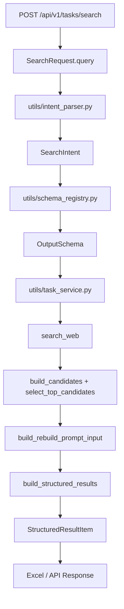

# Day 5：通用系统定位、Intent 层与 Schema 抽象

## 今天的总目标

- 不再把项目解释成“某个垂直场景的搜索工具”。
- 把项目重新表述为一个通用的 `Natural Language Query -> Structured Data Output` 系统。
- 在现有 `search -> rank -> structure -> export` 主链路前面补上 Intent 层，在结构化输出前补上 Schema 抽象层。

今天最重要的变化是：

> 系统本来已经能处理开放领域 query，但代码和 README 没有显式表达这种通用性。Day 5 要把“通用系统能力”从隐含实现变成可见架构。

## 今天结束前，你必须拿到什么

- `schemas/intent_schema.py`：定义 `SearchIntent`，让 query 不再是裸字符串。
- `schemas/agent_schema.py`：集中定义执行计划、任务记忆和输出 schema 的轻量边界模型。
- `utils/intent_parser.py`：用轻量规则把自然语言 query 解析为 intent。
- `utils/schema_registry.py`：根据 intent 解析目标 schema，当前先返回 generic schema。
- `utils/task_service.py` 的改造方案：在执行搜索前先解析 intent 和 schema。
- `README.md` 的表达升级草案：明确项目是通用结构化数据生成系统。

---

## Day 5 一图总览

如果把 Day 5 压缩成一句话，它做的就是：

> 把“看起来 hardcode 的搜索 workflow”升级为“通用自然语言到结构化数据 pipeline”。

今天的主链路可以先背成这样：

```text
SearchRequest.query
-> parse_search_intent
-> resolve_output_schema
-> search_web
-> build_candidates
-> select_top_candidates
-> build_rebuild_prompt_input
-> build_structured_results
-> export_results_to_excel
```

你今天要特别清楚：

- Day 4 的重点是任务平台接口和可观测性。
- Day 5 的重点是系统定位、Intent 层和 Schema 抽象。
- Intent 层证明系统不是 blind pipeline。
- Schema 抽象证明当前固定字段只是默认 schema，不是能力上限。

---

## 为什么 Day 5 也要重构

`polish2.md` 里最关键的一句话是：

> 系统是通用的，但“看起来不是”。

当前项目的问题不是不能完成任务，而是表达上容易被误解：

- `SearchRequest.query` 直接进入后续流程，缺少意图解释。
- `StructuredResultItem` 看起来像固定业务输出，缺少 schema 抽象。
- `task_service.py` 直接串起搜索、排序、结构化、导出，看起来像 hardcode workflow。
- README 对“通用结构化数据生成系统”的定位表达不够强。

所以今天不是重写业务，而是补两个架构层：

```text
Intent Layer：解释用户想做什么
Schema Layer：解释这次应该输出什么结构
```

补完后，你对项目的定义应该升级为：

```text
这是一个通用的自然语言到结构化数据生成系统，
支持开放领域查询，并通过多阶段 pipeline 输出结构化结果。
Excel 只是其中一种输出载体。
```

---

## Day 5 整体架构



### 第 1 层：API 输入层

这一层仍然由 `routers/task_router.py` 和 `schemas/search_schema.py` 承担。

它只负责：

- 接收 query。
- 校验 `max_results`。
- 创建任务。
- 投递 worker。

它不负责判断 query 属于什么任务，也不直接决定输出字段。

### 第 2 层：Intent 层

这一层新增在 `utils/intent_parser.py`。

它负责：

- 归一化 query。
- 判断 intent 类型。
- 记录 intent 解析原因。
- 为后续 schema 选择提供依据。

今天先用规则版，不用 LLM。

### 第 3 层：Schema 层

这一层新增在 `utils/schema_registry.py`。

它负责：

- 定义系统支持哪些输出 schema。
- 根据 intent 返回目标 schema。
- 明确当前 `StructuredResultItem` 是默认 generic schema。

### 第 4 层：执行层

这一层仍然由现有 `utils/task_service.py` 编排。

它继续复用：

- `search_web`
- `build_candidates`
- `select_top_candidates`
- `build_rebuild_prompt_input`
- `build_structured_results`
- `export_results_to_excel`

不要把稳定的执行链路拆乱。

---

## 今天的边界要讲透

## 第 1 层：Day 5 不是把系统改成某个垂直场景 Agent

`polish2.md` 明确要求避免这个误区。

不要说：

```text
这是一个某行业 Agent / 某业务线 Agent / 某垂直场景 Agent。
```

要说：

```text
这是一个通用结构化数据生成系统，任何垂直查询都只是它的应用场景之一。
```

## 第 2 层：Day 5 不是做复杂 Intent 分类器

今天先做领域无关的最小规则版，不按业务词分类，而按查询形态分类：

- `lookup`：查询一个主题、实体、概念或资料。
- `collection`：希望系统收集一组候选结果、清单、列表或资源集合。
- `comparison`：希望系统比较多个对象或找差异。
- `general`：无法稳定判断时的默认开放领域查询。

原因很简单：

- 当前输入类型少。
- 规则可测试。
- 不增加 LLM 成本。
- 能先把架构层补出来。
- 不会把系统错误绑定到任何单一行业、业务线或垂直领域。

## 第 3 层：Schema 抽象不是为了马上支持十种 schema

今天即使只返回一个 `generic_schema`，也必须抽象出来。

面试官看的不是你现在有多少 schema，而是：

- 你是否知道 schema 应该是可解析、可替换的。
- 你是否把“固定字段”解释成“默认配置”，而不是系统限制。

## 第 4 层：不要把 schema 逻辑塞进 prompt 字符串

错误做法是：

```text
直接在 result_prompt.py 里写死所有字段含义。
```

更好的做法是：

```text
schema_registry.py 负责定义字段集合
result_prompt.py 负责把字段约束表达给 LLM
structured_result_builder.py 负责解析和归一化
```

## 第 5 层：今天不碰数据库结构

Intent 和 schema 今天可以先作为运行期上下文。

不需要立刻新增：

- `task_records.intent_payload`
- `task_records.schema_name`
- migration

这些可以放到后续增强。

---

## 上午学习：09:00 - 12:00

## 09:00 - 09:40：统一项目定位

先把项目一句话定义背熟：

```text
这是一个通用的 Natural Language -> Structured Data Pipeline System。
它支持开放领域查询，并通过搜索、候选构建、结构化生成和导出，输出可复用结构化结果。
```

你必须能解释：

1. 为什么它不是某个垂直场景 Agent？
2. 为什么 Excel 只是输出载体？
3. 为什么开放领域 query 才是这个系统的核心定位？

## 09:40 - 10:30：设计 `SearchIntent`

今天建议最小字段是：

- `query`：清洗后的 query。
- `intent_type`：`general / lookup / collection / comparison`。
- `target_schema_name`：目标 schema 名称。
- `structured_required`：是否需要结构化输出。
- `reason`：为什么这样判断。

这能把输入从字符串升级为语义任务。

## 10:30 - 11:20：设计 `OutputSchema`

今天建议最小字段是：

- `name`
- `description`
- `fields`
- `required_fields`
- `version`

注意：字段定义不需要一开始做得很复杂。

你今天要表达的是：

> 当前默认输出结构是 generic schema；以后可以根据查询形态和输出需求替换为列表 schema、对比 schema、实体资料 schema 或其他结构化 schema。

## 11:20 - 12:00：决定接入点

今天的最小接入点只有一个：

```python
query = clean_text(request.query)
intent = parse_search_intent(query)
output_schema = resolve_output_schema(intent)
```

然后仍然沿用现有执行链路。

不要为了抽象而破坏已经跑通的任务系统。

---

## 下午编码：14:00 - 18:00

## 14:00 - 14:45：新增 `schemas/intent_schema.py`

先定义 intent 边界模型。

### `schemas/intent_schema.py` 练手骨架版

```python
from typing import Literal

from pydantic import BaseModel, Field


IntentType = Literal["general", "lookup", "collection", "comparison"]


class SearchIntent(BaseModel):
    # TODO:
    # 1. 保存清洗后的 query
    # 2. 保存 intent_type
    # 3. 保存 target_schema_name
    # 4. 保存 structured_required
    # 5. 保存 reason
    raise NotImplementedError
```

### `schemas/intent_schema.py` 参考答案

```python
from typing import Literal

from pydantic import BaseModel, Field


IntentType = Literal["general", "lookup", "collection", "comparison"]


class SearchIntent(BaseModel):
    query: str = Field(..., min_length=1)
    intent_type: IntentType = "general"
    target_schema_name: str = "generic_search_result"
    structured_required: bool = True
    reason: str = ""
```

## 14:45 - 15:30：在 `schemas/agent_schema.py` 中补充输出 Schema 类型

这个文件用于表达输出 schema 的契约。

### `schemas/agent_schema.py` 练手骨架版

```python
from pydantic import BaseModel, Field


class OutputSchemaField(BaseModel):
    # TODO: 定义字段名、说明、是否必填
    raise NotImplementedError


class OutputSchema(BaseModel):
    # TODO: 定义 schema 名称、版本、说明、字段列表
    raise NotImplementedError
```

### `schemas/agent_schema.py` 参考答案

```python
from pydantic import BaseModel, Field


class OutputSchemaField(BaseModel):
    name: str
    description: str = ""
    required: bool = True


class OutputSchema(BaseModel):
    name: str
    version: str = "v1"
    description: str = ""
    fields: list[OutputSchemaField] = Field(default_factory=list)

    @property
    def required_fields(self) -> list[str]:
        return [field.name for field in self.fields if field.required]
```

## 15:30 - 16:10：新增 `utils/intent_parser.py`

今天先写规则版。

### `utils/intent_parser.py` 练手骨架版

```python
from schemas.intent_schema import SearchIntent
from utils.task_service_helpers import clean_text


def parse_search_intent(query: str) -> SearchIntent:
    # TODO:
    # 1. 清洗 query
    # 2. 根据查询形态判断 lookup / collection / comparison / general
    # 3. 返回 SearchIntent
    raise NotImplementedError
```

### `utils/intent_parser.py` 参考答案

```python
from schemas.intent_schema import SearchIntent
from utils.task_service_helpers import clean_text


COLLECTION_SIGNALS = ("有哪些", "列表", "清单", "大全", "推荐", "top", "best", "list")
COMPARISON_SIGNALS = ("对比", "比较", "区别", "差异", "vs", "versus", "compare")
LOOKUP_SIGNALS = ("是什么", "介绍", "资料", "信息", "指南", "如何", "怎么", "overview", "guide")


def parse_search_intent(query: str) -> SearchIntent:
    normalized_query = clean_text(query)
    lowered = normalized_query.lower()

    if any(signal in lowered for signal in COMPARISON_SIGNALS):
        return SearchIntent(
            query=normalized_query,
            intent_type="comparison",
            target_schema_name="generic_search_result",
            reason="query 命中对比 / 差异类表达，按 comparison 查询形态处理",
        )

    if any(signal in lowered for signal in COLLECTION_SIGNALS):
        return SearchIntent(
            query=normalized_query,
            intent_type="collection",
            target_schema_name="generic_search_result",
            reason="query 命中列表 / 集合类表达，按 collection 查询形态处理",
        )

    if any(signal in lowered for signal in LOOKUP_SIGNALS):
        return SearchIntent(
            query=normalized_query,
            intent_type="lookup",
            target_schema_name="generic_search_result",
            reason="query 命中资料 / 介绍类表达，按 lookup 查询形态处理",
        )

    return SearchIntent(
        query=normalized_query,
        intent_type="general",
        target_schema_name="generic_search_result",
        reason="未命中特定查询形态信号，按开放领域通用查询处理",
    )
```

## 16:10 - 17:00：新增 `utils/schema_registry.py`

当前先定义一个 generic schema，对应现有 `StructuredResultItem`。

### `utils/schema_registry.py` 练手骨架版

```python
from schemas.intent_schema import SearchIntent
from schemas.agent_schema import OutputSchema


def get_generic_search_result_schema() -> OutputSchema:
    # TODO: 返回当前 StructuredResultItem 对应的通用 schema
    raise NotImplementedError


def resolve_output_schema(intent: SearchIntent) -> OutputSchema:
    # TODO: 当前先返回 generic schema，未来可按 intent_type 扩展
    raise NotImplementedError
```

### `utils/schema_registry.py` 参考答案

```python
from schemas.intent_schema import SearchIntent
from schemas.agent_schema import OutputSchema, OutputSchemaField


def get_generic_search_result_schema() -> OutputSchema:
    return OutputSchema(
        name="generic_search_result",
        version="v1",
        description="开放领域查询的默认结构化搜索结果 schema",
        fields=[
            OutputSchemaField(name="query", description="用户原始查询"),
            OutputSchemaField(name="title", description="结果标题"),
            OutputSchemaField(name="source", description="来源站点或域名"),
            OutputSchemaField(name="url", description="结果链接"),
            OutputSchemaField(name="content_type", description="内容类型", required=False),
            OutputSchemaField(name="region", description="地域信息", required=False),
            OutputSchemaField(name="role_direction", description="角色或主题方向", required=False),
            OutputSchemaField(name="summary", description="结构化摘要", required=False),
            OutputSchemaField(name="quality_score", description="结果质量分", required=False),
            OutputSchemaField(name="extraction_notes", description="抽取说明", required=False),
        ],
    )


def resolve_output_schema(intent: SearchIntent) -> OutputSchema:
    if intent.target_schema_name == "generic_search_result":
        return get_generic_search_result_schema()
    return get_generic_search_result_schema()
```

## 17:00 - 17:35：改造 `utils/task_service.py` 接入点

今天不需要大拆 `run_search_task`，只需要在 `query` 清洗后增加 intent 和 schema。

### `utils/task_service.py` 集成片段参考

```python
from utils.intent_parser import parse_search_intent
from utils.schema_registry import resolve_output_schema


query = clean_text(request.query)
intent = parse_search_intent(query)
output_schema = resolve_output_schema(intent)

logger.info(
    "task={} stage=intent intent_type={} schema={} reason={}",
    task_id,
    intent.intent_type,
    output_schema.name,
    intent.reason,
)
```

后续调用仍然使用：

```python
search_results = await search_web(intent.query, max_results=fetch_limit)
```

这里的重点是：

- query 不再裸奔。
- schema 决策有独立位置。
- 现有 pipeline 仍然稳定。

## 17:35 - 18:00：补 README 的系统定位

建议在 README 增加：

```markdown
## System Design Philosophy

This system is designed as a generalized pipeline:

Natural Language Query -> Structured Data Output

It is use-case agnostic and supports multiple query shapes.
Any concrete search scenario is only one possible use case, not the system boundary.
Excel export is one output carrier, not the core capability.
```

同时把项目一句话更新为：

```text
一个通用的自然语言到结构化数据生成系统，支持开放领域查询，并通过多阶段 pipeline 输出可复用结构化结果。
```

---

## 晚上复盘：20:00 - 21:00

今晚你必须自己讲顺的 8 个点：

1. 为什么这个项目不应该被定义成某个垂直场景 Agent？
2. 为什么 `Natural Language -> Structured Data` 才是正确定位？
3. Intent 层解决了什么问题？
4. Schema 抽象解决了什么问题？
5. 为什么当前只返回 generic schema 也有价值？
6. 为什么不把 schema 逻辑直接写死在 prompt 里？
7. 为什么今天不需要改数据库？
8. Day 5 和 Day 4 的边界有什么不同？

---

## 今日验收标准

- 已有 `SearchIntent` 模型。
- 已有 `OutputSchema` 和字段模型。
- 已有 `parse_search_intent`。
- 已有 `resolve_output_schema`。
- `task_service` 的执行入口能记录 intent 和 schema。
- README 已明确系统是通用结构化数据生成系统，而不是垂直场景 Agent。
- 测试能覆盖 general / lookup / collection / comparison 四类 intent。

---

## 今天最容易踩的坑

### 坑 1：继续用垂直场景定义项目

问题：

- 项目通用能力会被低估。

规避建议：

- 统一说法：任意具体业务查询都只是应用场景，不是系统边界。

### 坑 2：Schema 抽象做得太重

问题：

- 当前项目还不需要复杂 schema DSL。

规避建议：

- 先用 `OutputSchema + OutputSchemaField`，能解释、能测试即可。

### 坑 3：Intent parser 一上来调用 LLM

问题：

- 增加成本和失败点。

规避建议：

- 先用规则版，等需求复杂后再升级。

### 坑 4：为了抽象改乱主链路

问题：

- 原本稳定的任务执行会变脆。

规避建议：

- Day 5 只在主链路前增加 intent 和 schema，不重写执行器。

---

## 给明天的交接提示

Day 5 解决的是：

> 这个系统为什么是通用系统，而不是垂直工具。

Day 6 要继续补的是：

> 这个通用系统为什么具备 Agent-like 能力。

所以明天要在今天的 Intent 和 Schema 基础上继续补：

- Planner：从 hardcode pipeline 升级为可解释计划。
- Tool abstraction：把函数能力注册成工具。
- Task Memory：记录单次任务的中间状态。
- result_quality：对输出结果做轻量质量标注，不单独引入自我评估模块。
- README 的 Design Trade-offs：把“没做什么”解释成清晰选择。
