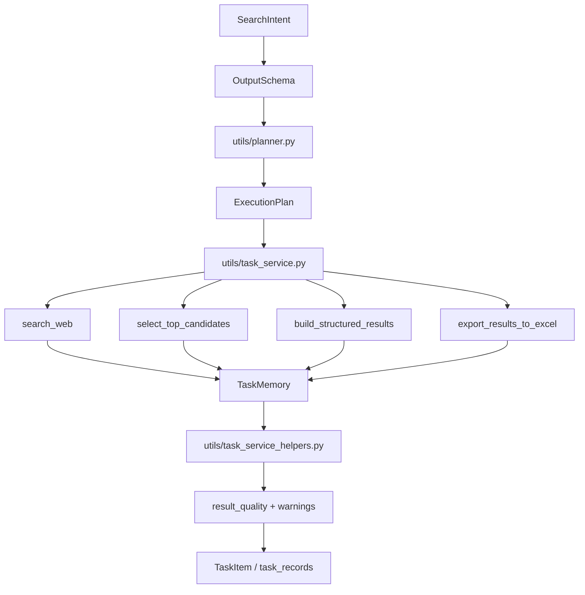

# Day 6：Planner、Tool 抽象、Task Memory 与质量标注

## 今天的总目标

- 不再让系统看起来只是 hardcode pipeline。
- 在 Day 5 的 Intent 和 Schema 基础上，补齐 Agent-like 系统最关键的三个抽象：Planner、Tool、Task Memory。
- 用轻量 `result_quality` 标注替代独立自我评估模块，避免把系统做重。
- 把 README 的表达从“能运行的项目说明”升级为“有设计判断的系统说明”。

今天最重要的变化是：

> Day 5 证明系统是通用的；Day 6 要证明这个通用系统具备 Agent-like 的核心设计要素。

## 今天结束前，你必须拿到什么

- `schemas/agent_schema.py`：定义 `PlanStep`、`ExecutionPlan`、`TaskMemory` 和输出 schema 边界。
- `utils/planner.py`：根据 `SearchIntent` 和 `OutputSchema` 生成执行计划。
- `utils/task_service_helpers.py`：集中放置结果拼装、fallback 和轻量质量标注 helper。
- `utils/task_service.py` 的改造方案：记录 plan、memory 和 result quality。
- `README.md` 的 `Design Trade-offs` 草案：解释 HTML 搜索、top-k、snippet、轻量质量标注的取舍。

---

## Day 6 一图总览

如果把 Day 6 压缩成一句话，它做的就是：

> 把固定执行链路包装成可解释、可扩展、可复盘的 Agent-like pipeline。

今天的主链路可以先背成这样：

```text
SearchIntent + OutputSchema
-> build_execution_plan
-> run existing pipeline
-> record TaskMemory
-> evaluate result_quality
-> persist structured output
```

你今天要特别清楚：

- Planner 负责“计划”，不负责亲自执行。
- 工具语义直接体现在 `PlanStep.tool_name` 中，不再单独维护 registry。
- Task Memory 负责“记录单次任务状态”，不是长期记忆。
- 质量标注只负责显式暴露结果状态，不做自动重试或自我修复。

---

## 为什么 Day 6 也要重构

`polish2.md` 对 Agent 能力设计的扣分点很明确：

- 没有 Planner。
- 函数没有 Tool 抽象。
- 没有 Task Memory。

当前项目的执行链路其实已经具备 Agent-like 的基础能力：

- `search_web` 是搜索工具。
- `select_top_candidates` 是候选排序工具。
- `build_structured_results` 是结构化生成工具。
- `export_results_to_excel` 是输出工具。

但这些能力目前只是散落的函数调用。Day 6 要做的是：

```text
把已有能力显式命名、描述、计划、记录和标注质量。
```

这不是为了引入重框架，而是为了让面试官看出：

> 这是 workflow-first，但已经具备 Planner、Tool、Memory 和质量解释能力的 Agent-like 系统。

---

## Day 6 整体架构



### 第 1 层：Planner

Planner 负责把 Day 5 的 intent 和 schema 转成执行计划。

它回答：

- 为什么要 search？
- 为什么要 rank？
- 为什么要 structure？
- 为什么要 export？

它不负责：

- 直接调用搜索。
- 直接调用 LLM。
- 写数据库。

### 第 2 层：Tool Names

工具语义直接体现在 `ExecutionPlan.steps[].tool_name` 中。

今天只给已有函数绑定稳定工具名：

- `web_search`
- `candidate_rank`
- `result_structure`
- `excel_export`

不要为了抽象再额外维护单独的工具注册表。当前项目只需要可解释的工具名，不需要动态工具调度。

### 第 3 层：Task Memory

Task Memory 负责记录单次任务的关键中间状态。

建议记录：

- intent type
- schema name
- plan id
- raw result count
- selected candidate count
- structured result count
- used fallback
- result quality
- warnings

它先不需要持久化。

### 第 4 层：Result Quality

Result Quality 负责做一次轻量质量标注。

建议只判断：

- 是否空结果。
- 是否 fallback。
- 平均质量分是否过低。
- URL 是否缺失。

它不是多轮 Agent 循环，也不负责自动重试。

---

## 今天的边界要讲透

## 第 1 层：Day 6 不是引入 LangGraph 或复杂 Agent 框架

当前项目的目标是提分和表达，不是重构成重型 Agent runtime。

不要引入：

- LangGraph 状态图。
- ReAct 多轮循环。
- 多 Agent 协作。
- 长期记忆。
- 向量记忆。

今天只补轻量抽象。

## 第 2 层：Planner 不执行任务

错误做法是：

```text
planner.run_all_tools()
```

正确做法是：

```text
planner.plan(intent, schema) -> ExecutionPlan
task_service 按当前稳定链路执行
```

这样既有 Agent 表达，又不牺牲工程可控性。

## 第 3 层：Tool 抽象不等于额外注册表

今天的 Tool 抽象只保留在计划步骤里：

- `step.name`
- `step.tool_name`
- `step.description`

这样足够表达 Agent-like 工具语义，又不会增加一个只服务于展示的 registry 模块。

## 第 4 层：Memory 是 task-scoped

不要把 Day 6 的 memory 说成用户长期记忆。

正确说法是：

```text
TaskMemory 是单次任务的短期工作记忆，用于 debug、explainability 和 future replay。
```

## 第 5 层：质量标注不是自我修复

今天的目标不是自动修好所有问题，而是让低质量结果被显式识别。

---

## 上午学习：09:00 - 12:00

## 09:00 - 09:40：先把 Agent-like 口径讲顺

推荐表达：

```text
这个项目不是完整 autonomous agent。
它是 workflow-first 的 Agent-like structured data pipeline，
具备 Intent、Schema、Planner、Tool Names、Task Memory 和轻量结果质量标注。
```

这句话能避免两个风险：

- 过度包装成完整 Agent。
- 被低估成普通 workflow。

## 09:40 - 10:25：设计 ExecutionPlan

计划不需要复杂，必须清晰。

最小字段：

- `plan_id`
- `intent_type`
- `schema_name`
- `steps`
- `summary`

每个 step 最小字段：

- `name`
- `tool_name`
- `description`
- `required`

## 10:25 - 11:05：设计 PlanStep 的工具语义

不要单独做工具规格模型。当前更轻的做法是把工具名直接挂在 `PlanStep` 上。

`PlanStep` 的最小字段：

- `name`
- `tool_name`
- `description`
- `required`

你今天要能解释：

> search_web 是函数实现，web_search 是计划中的工具语义。

## 11:05 - 11:35：设计 TaskMemory

TaskMemory 先只记录运行期状态。

建议字段：

- `task_id`
- `intent_type`
- `schema_name`
- `plan_id`
- `raw_result_count`
- `selected_candidate_count`
- `structured_result_count`
- `used_fallback`
- `result_quality`
- `warnings`

## 11:35 - 12:00：设计 result_quality

质量标注规则要简单到能测试：

- 空结果 -> `low`
- fallback -> `fallback`
- 平均质量分低于 50 -> `low`
- URL 缺失 -> `low`
- 否则 -> `high`

---

## 下午编码：14:00 - 18:00

## 14:00 - 14:45：新增 `schemas/agent_schema.py`

先定义 Planner、Tool、Memory 的边界模型。

### `schemas/agent_schema.py` 练手骨架版

```python
from pydantic import BaseModel, Field


class PlanStep(BaseModel):
    # TODO: 定义 name、tool_name、description、required
    raise NotImplementedError


class ExecutionPlan(BaseModel):
    # TODO: 定义 plan_id、intent_type、schema_name、steps、summary
    raise NotImplementedError


class TaskMemory(BaseModel):
    # TODO: 定义单次任务中间状态字段
    raise NotImplementedError
```

### `schemas/agent_schema.py` 参考答案

```python
from pydantic import BaseModel, Field


class PlanStep(BaseModel):
    name: str
    tool_name: str
    description: str = ""
    required: bool = True


class ExecutionPlan(BaseModel):
    plan_id: str
    intent_type: str
    schema_name: str
    steps: list[PlanStep] = Field(default_factory=list)
    summary: str = ""


class TaskMemory(BaseModel):
    task_id: str
    intent_type: str = "general"
    schema_name: str = "generic_search_result"
    plan_id: str = ""
    raw_result_count: int = 0
    selected_candidate_count: int = 0
    structured_result_count: int = 0
    used_fallback: bool = False
    result_quality: str = "unknown"
    warnings: list[str] = Field(default_factory=list)
```

## 14:45 - 15:25：新增 `utils/planner.py`

Planner 使用 Day 5 的 `SearchIntent` 和 `OutputSchema`。

### `utils/planner.py` 练手骨架版

```python
from schemas.agent_schema import ExecutionPlan
from schemas.intent_schema import SearchIntent
from schemas.agent_schema import OutputSchema


def build_execution_plan(
    intent: SearchIntent,
    output_schema: OutputSchema,
) -> ExecutionPlan:
    # TODO:
    # 1. 生成 search / rank / structure / export 四步
    # 2. 每步绑定 tool_name
    # 3. summary 解释 intent 和 schema
    raise NotImplementedError
```

### `utils/planner.py` 参考答案

```python
from schemas.agent_schema import ExecutionPlan, PlanStep
from schemas.intent_schema import SearchIntent
from schemas.agent_schema import OutputSchema


def build_execution_plan(
    intent: SearchIntent,
    output_schema: OutputSchema,
) -> ExecutionPlan:
    steps = [
        PlanStep(name="search", tool_name="web_search", description="获取开放网页候选结果"),
        PlanStep(name="rank", tool_name="candidate_rank", description="对候选结果去重、重排并截取 top-k"),
        PlanStep(name="structure", tool_name="result_structure", description=f"按 {output_schema.name} 生成结构化结果"),
        PlanStep(name="export", tool_name="excel_export", description="将结构化结果导出为 Excel 载体"),
    ]
    return ExecutionPlan(
        plan_id=f"{intent.intent_type}_{output_schema.name}_v1",
        intent_type=intent.intent_type,
        schema_name=output_schema.name,
        steps=steps,
        summary=(
            f"根据 {intent.intent_type} intent 和 {output_schema.name} schema "
            "执行 search -> rank -> structure -> export"
        ),
    )
```

## 15:25 - 16:05：在 `utils/task_service_helpers.py` 中补充质量标注 helper

这个 helper 只做质量标注，不做自我评估循环或自动重试。

### `utils/task_service_helpers.py` 练手骨架版

```python
from pydantic import BaseModel, Field

from schemas.search_schema import StructuredResultItem


class ResultQualityCheck(BaseModel):
    # TODO: result_quality、warnings
    raise NotImplementedError


def evaluate_result_quality(
    items: list[StructuredResultItem],
    *,
    used_fallback: bool,
) -> ResultQualityCheck:
    # TODO:
    # 1. 空结果 -> low
    # 2. fallback -> fallback
    # 3. 平均 quality_score 低 -> low
    # 4. 否则 high
    raise NotImplementedError
```

### `utils/task_service_helpers.py` 参考答案

```python
from pydantic import BaseModel, Field

from schemas.search_schema import StructuredResultItem


class ResultQualityCheck(BaseModel):
    result_quality: str = "unknown"
    warnings: list[str] = Field(default_factory=list)


def _average_quality(items: list[StructuredResultItem]) -> float:
    if not items:
        return 0.0
    return sum(item.quality_score for item in items) / len(items)


def evaluate_result_quality(
    items: list[StructuredResultItem],
    *,
    used_fallback: bool,
) -> ResultQualityCheck:
    if not items:
        return ResultQualityCheck(
            result_quality="low",
            warnings=["structured result is empty"],
        )

    if used_fallback:
        return ResultQualityCheck(
            result_quality="fallback",
            warnings=["structured result was generated by fallback path"],
        )

    warnings: list[str] = []
    if _average_quality(items) < 50:
        warnings.append("average quality_score is below 50")
    if any(not item.url for item in items):
        warnings.append("some structured items have empty url")

    if warnings:
        return ResultQualityCheck(result_quality="low", warnings=warnings)

    return ResultQualityCheck(result_quality="high")
```

## 16:05 - 17:35：改造 `utils/task_service.py`

建议在 Day 5 的 intent/schema 后继续接入 plan/memory。

### `utils/task_service.py` 集成片段参考

```python
from schemas.agent_schema import TaskMemory
from utils.planner import build_execution_plan
from utils.task_service_helpers import evaluate_result_quality


intent = parse_search_intent(query)
output_schema = resolve_output_schema(intent)
plan = build_execution_plan(intent, output_schema)
memory = TaskMemory(
    task_id=task_id,
    intent_type=intent.intent_type,
    schema_name=output_schema.name,
    plan_id=plan.plan_id,
)

```

在关键节点更新 memory：

```python
search_results = await search_web(intent.query, max_results=fetch_limit)
memory.raw_result_count = len(search_results)

candidates = select_top_candidates(intent.query, raw_candidates, top_k=FIXED_TOP_K)
memory.selected_candidate_count = len(candidates)

final_items = await extract_structured_results(...)
memory.structured_result_count = len(final_items)
memory.used_fallback = any("fallback" in item.extraction_notes for item in final_items)

quality_check = evaluate_result_quality(
    final_items,
    used_fallback=memory.used_fallback,
)
memory.result_quality = quality_check.result_quality
memory.warnings.extend(quality_check.warnings)
```

今天先把 memory 写入日志即可：

```python
logger.info(
    "task={} stage=agent_memory plan={} raw={} selected={} structured={} quality={} warnings={}",
    task_id,
    memory.plan_id,
    memory.raw_result_count,
    memory.selected_candidate_count,
    memory.structured_result_count,
    memory.result_quality,
    memory.warnings,
)
```

## 17:35 - 18:00：补 README 的 Design Trade-offs

建议新增：

````markdown
## Agent-like Architecture

This project is not positioned as a fully autonomous agent.
It is a workflow-first Agent-like structured data pipeline.

```text
Natural Language Query
-> Intent Parser
-> Schema Resolver
-> Planner
-> Planned Pipeline: Search -> Rank -> Structure -> Export
-> Task Memory
-> Result Quality Check
-> Structured Data Output
```

## Design Trade-offs

- HTML search provider: lower cost and easier local demo, but less stable than commercial search APIs.
- top-k=5: balances recall, LLM token cost, latency, and structured output stability.
- snippet-based extraction: keeps the system lightweight, but sacrifices page-level information density.
- generic schema first: proves the schema layer exists without overbuilding query-shape-specific schema variants too early.
- lightweight result quality check: catches low-quality outputs without introducing unpredictable multi-turn loops.
- task-scoped memory: supports debugging and explainability without adding long-term user memory.
- no separate tool registry: tool names live directly on plan steps to keep runtime code small.
````

README 的重点不是堆功能，而是把“不做什么”和“为什么现在不做”说清楚。

---

## 晚上复盘：20:00 - 21:00

今晚你必须自己讲顺的 9 个点：

1. Planner 和 hardcode pipeline 的区别是什么？
2. 为什么 Planner 不应该亲自执行工具？
3. 为什么工具语义放在 `PlanStep.tool_name` 里就够？
4. 为什么现在不需要动态 tool calling？
5. TaskMemory 为什么是 task-scoped？
6. 为什么质量标注不应该发展成自动重试循环？
7. 怎么解释这个项目是 Agent-like 而不是完整 autonomous agent？
8. Day 5 的 Intent/Schema 和 Day 6 的 Planner 怎么衔接？
9. README 的 trade-off 为什么能提升项目评分？

---

## 今日验收标准

- 已有 `ExecutionPlan`、`PlanStep`、`TaskMemory` 和 `OutputSchema`。
- 已有 `build_execution_plan(intent, output_schema)`。
- 已有 `evaluate_result_quality()`。
- `task_service` 能记录 plan id、memory 摘要和 result quality。
- README 已补 Agent-like Architecture 和 Design Trade-offs。
- 测试覆盖 planner 步骤、工具名完整性、result quality 三种状态。

---

## 今天最容易踩的坑

### 坑 1：把 Agent-like 说成完整 Agent

问题：

- 容易被追问多轮规划、工具选择、长期记忆、自动纠错。

规避建议：

- 明确说 workflow-first，但具备 Agent 核心要素。

### 坑 2：Planner 做成大而全执行器

问题：

- 会把现有 `task_service.py` 的稳定链路藏起来。

规避建议：

- Planner 只生成计划，执行仍由 task service 负责。

### 坑 3：为了 Tool 抽象新增太多代码

问题：

- 当前目标是补表达和边界，不是重写 runtime。

规避建议：

- 先把工具名放在 `PlanStep.tool_name`，不新增 registry。

### 坑 4：Memory 被误解为长期记忆

问题：

- 会引出不必要的用户画像、向量库和隐私问题。

规避建议：

- 明确 memory 只在单次任务范围内工作。

### 坑 5：质量标注变成自动 retry

问题：

- 成本和行为不可控。

规避建议：

- Day 6 只做质量标注，不在这里触发自动重试。

---

## 给后续优化的交接提示

Day 6 之后，项目表达已经从：

```text
结构化联网搜索后台任务系统
```

升级为：

```text
通用 Natural Language -> Structured Data Pipeline System，
具备 Intent、Schema、Planner、Tool Names、Task Memory 和轻量结果质量标注。
```

后续如果继续优化，建议 Day 7 再考虑：

- 把 `TaskMemory` 的摘要持久化到 task debug payload。
- 根据 `intent_type` 增加更细的查询形态 schema 或输出 schema variants。
- 对 top-k 结果做可选正文抓取。
- 把 result quality warning 暴露到 `TaskItem.warnings`。
- 在 Excel 中增加 result_quality 或 schema_name。

但这些都不是 Day 6 的默认范围。Day 6 的核心是把 Agent 抽象缺口补齐，并让项目的设计取舍能被读懂。
